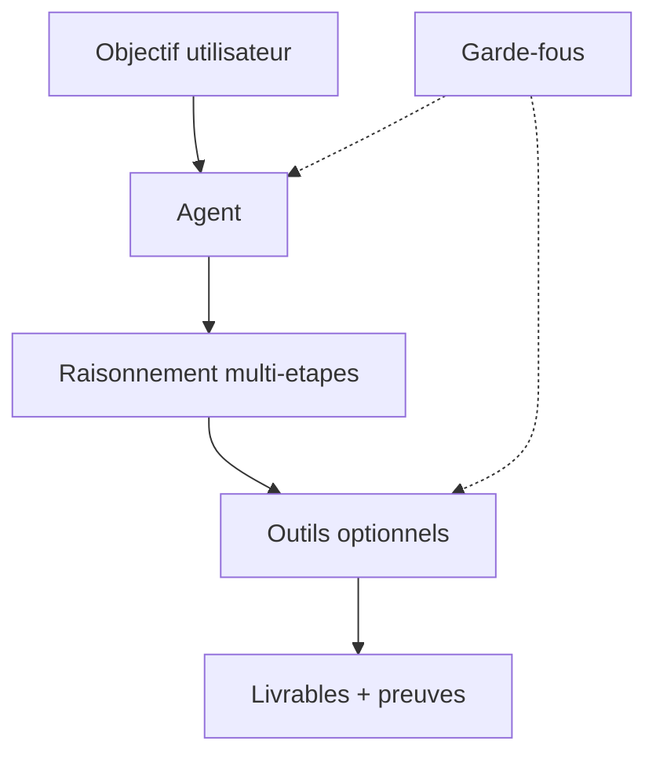
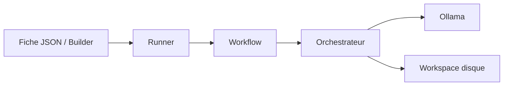

# 01 — Qu'est-ce qu'un agent ?

## En une phrase

Un **agent** est un système qui utilise un modèle de langage pour **poursuivre un objectif**, en **plusieurs étapes**, et qui peut **appeler des outils** (lire, chercher, exécuter, écrire) dans un **cadre explicite** (rôle, entrées, sorties, garde-fous).

---

## Ce qu'un agent n'est pas

| Confusion fréquente | Pourquoi ce n'est pas un agent |
|---------------------|--------------------------------|
| Un simple appel « question → réponse » au modèle | Pas d'objectif durable ni d'enchaînement d'actions |
| Un long `system prompt` sans structure | Pas de contrat vérifiable (inputs/outputs, limites) |
| Un script Python fixe | Pas de raisonnement adaptatif du modèle |
| Un workflow entier | Le workflow **orchestre** plusieurs agents ; l'agent est une **fiche de rôle** |

Phrase utile (voir [LEXICAL.md](../LEXICAL.md)) : *« L'agent décide quand lire, chercher, exécuter ou vérifier. »*

---

## Double regard : concept IA vs plateforme orchestrateur

### Niveau A — Concept (portable)

Composants conceptuels :

- **Objectif** : ce qu'on veut obtenir (mesurable si possible).
- **Rôle / mission** : qui est l'agent et ce qu'il doit faire (et ne pas faire).
- **Contexte** : informations fournies pour cette exécution (fichiers, historique, contraintes).
- **Outils** : capacités exécutables (lire un fichier, appeler une API, lancer une commande).
- **Garde-fous** : règles non négociables (lecture seule, périmètre de chemins, pas de suppression sans validation).

### Niveau B — Plateforme (ce dépôt)

| Couche | Où ça vit | Rôle |
|--------|-----------|------|
| **Fiche agent** | `catalog/agents/*.json`, Builder → `custom-{slug}` | Identité métier : mission, capacités, I/O, garde-fous |
| **Runner technique** | `runner_role` (ex. `schematic`, `code_backend`) | Code qui exécute l'agent (prompt, outils, format de sortie) |
| **Workflow** | `catalog/workflows/*.json` | Enchaînement d'étapes ; chaque étape pointe vers un `agent_definition_id` |
| **Orchestration** | `MultiAgentOrchestrator`, API `POST /workflows/*` | Coordination, mémoire partagée, handoffs, workspace |
| **Inférence** | Ollama (profils **live** vs **orchestration**) | Génération de texte ; pas l'orchestration elle-même |

---

## Agent, chat, workflow, sub-agent

| Notion | Rôle | Exemple dans ce projet |
|--------|------|------------------------|
| **Chat** | Dialogue direct modèle ↔ utilisateur, sans enchaînement d'agents catalogue | Onglet **Parcours**, `POST /v1/runtime/sampling/preview/stream` |
| **Agent** | Une fiche + une exécution pour une étape ou un rôle | `doc_inventory`, `write_tests` |
| **Workflow** | Plusieurs agents en séquence avec handoffs | `documentation-steward`, `team-tdd` |
| **Sub-agent** | Agent délégué à une **sous-tâche** isolée, avec périmètre plus petit | Concept (délégation) ; à distinguer d'un simple **outil** |
| **Outil** | Action atomique (lire, exécuter une commande) | MCP, filesystem, API HTTP |
| **Handoff** | Passage objectif + artefacts + contraintes entre étapes | Résumés `catalog_step_output_*` entre `doc_inventory` → `doc_sync` → `doc_qa` |

**Point important** : poser une question dans l'onglet **Parcours** n'invoque **pas** l'orchestrateur multi-agents. Voir [parcours-utilisateur.md](../docs/parcours-utilisateur.md).

---

## Le contrat `AgentDefinition`

Champs principaux (alignés sur `backend/core/contracts.py`) :

| Champ | Description |
|-------|-------------|
| `id` | Identifiant unique (slug, URL-friendly) |
| `name` | Nom affiché |
| `business_role` | Rôle métier en une ligne |
| `mission` | Objectif et comportement attendus (texte riche, borné) |
| `runner_role` | Runner technique ; vide = agent générique catalogue |
| `capabilities` | Liste de compétences déclarées |
| `inputs` | Ce dont l'agent a besoin pour travailler |
| `outputs` | Livrables attendus (vérifiables) |
| `guardrails` | Interdictions et limites explicites |

Une bonne fiche agent permet à un humain (ou à l'étape suivante du workflow) de répondre à :

1. **Quoi** produire ? (`outputs`)
2. **Avec quoi** travailler ? (`inputs`)
3. **Comment** ne pas déraper ? (`guardrails`)
4. **Qui** parle ? (`business_role`, `mission`)

---

## Matrice d'autorisations (cadre simple)

Pour tout agent qui touche au dépôt ou au système, documentez quatre colonnes :

| Colonne | Question |
|---------|----------|
| **Périmètre** | Quels chemins, services, APIs ? |
| **Actions** | Lecture (R) / proposition d'écriture (W?) / écriture (W) / suppression (D) / exécution (exec) |
| **Preuve** | Comment démontrer qu'il est resté dans le périmètre ? (citations, chemins, logs) |
| **Arrêt** | Quand s'arrêter ou escalader vers un humain ? |

Exemple : `doc_inventory` = **R** uniquement, preuve = chemin cité pour chaque fait, arrêt si source manquante.

Modèle vierge : [templates/matrice-autorisations.md](./templates/matrice-autorisations.md).

---

## Anti-patterns à éviter

1. **Mission fourre-tout** — « Aide l'utilisateur avec tout le projet. »
2. **Garde-fous vagues** — « Sois prudent » sans règle vérifiable.
3. **Outputs flous** — « Une bonne réponse » au lieu d'un artefact nommé.
4. **Confondre chat et orchestration** — attendre un workflow complet depuis l'onglet Parcours.
5. **Sub-agent trop tôt** — déléguer avant d'avoir défini handoff et périmètre.

---

## Suite

- Gabarit et exemples : [02-squelette-et-exemples.md](./02-squelette-et-exemples.md)
- Auto-évaluation : [03-evaluation-enonce.md](./03-evaluation-enonce.md)
- Mise en pratique : [04-atelier-progressif.md](./04-atelier-progressif.md)
