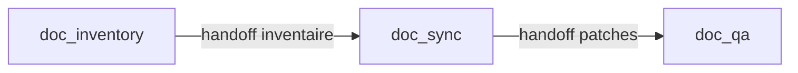

# 02 — Squelette et exemples d'agent

## Fichiers modèles

| Fichier | Usage |
|---------|--------|
| [templates/agent-vide.json](./templates/agent-vide.json) | Copier-coller pour démarrer |
| [templates/agent-exemple-minimal.json](./templates/agent-exemple-minimal.json) | Exemple niveau 0 (fiche seule) |
| Référence catalogue | `catalog/agents/doc_inventory.json`, `doc_sync.json`, `doc_qa.json` |

---

## Squelette JSON (catalogue)

```json
{
  "id": "mon-agent-slug",
  "name": "Nom affiché",
  "business_role": "Rôle métier en une phrase",
  "mission": "Objectif mesurable, borné, avec critères de fin explicites.",
  "runner_role": "",
  "capabilities": [],
  "inputs": [],
  "outputs": [],
  "guardrails": []
}
```

### Règles de nommage

- `id` : minuscules, tirets, pas d'espaces (ex. `doc-inventory-custom`).
- `runner_role` : laisser `""` pour un agent **générique catalogue** ; renseigner seulement si un runner dédié existe dans le code (ex. `schematic`, `code_backend`).
- Au moins **un** élément dans `guardrails` pour tout agent qui lit ou modifie le dépôt.

---

## Checklist avant de publier une fiche

Cochez chaque point :

- [ ] `id` unique et stable
- [ ] `mission` décrit le **résultat** et les **limites** (ce qui est hors scope)
- [ ] Chaque `output` est un **nom d'artefact** vérifiable (pas « une réponse utile »)
- [ ] Chaque `input` correspond à ce que l'orchestrateur ou l'étape précédente peut fournir
- [ ] `guardrails` contient au moins une règle **testable** (ex. lecture seule, citation obligatoire)
- [ ] Matrice d'autorisations remplie si l'agent touche fichiers / shell / API
- [ ] Cohérence avec un **niveau** de l'atelier (voir [04-atelier-progressif.md](./04-atelier-progressif.md))

---

## Exemple minimal commenté

Fichier : [templates/agent-exemple-minimal.json](./templates/agent-exemple-minimal.json)

| Champ | Valeur exemple | Commentaire |
|-------|----------------|-------------|
| `id` | `faq-reader` | Agent de formation, pas dans le catalogue officiel |
| `mission` | Répondre aux questions sur le README en citant le fichier | Borné : une source, pas tout le repo |
| `outputs` | `answer_with_citations` | Permet de noter si des citations sont absentes |
| `guardrails` | Ne pas inventer de sections absentes du README | Réduit les hallucinations |

---

## Exemple intermédiaire — lecture seule (niveau 2)

Inspiré de `doc_inventory` :

```json
{
  "id": "inventaire-lecture-seule",
  "name": "Inventaire documentation (exercice)",
  "business_role": "Cartographe lecture seule",
  "mission": "Lister les fichiers docs/*.md et README pertinents pour l'objectif utilisateur. Chaque affirmation doit citer un chemin relatif au dépôt. Ne proposer aucune modification de fichier.",
  "runner_role": "",
  "capabilities": ["repo_inventory", "doc_map"],
  "inputs": ["objectif utilisateur", "racine du dépôt"],
  "outputs": ["documentation_inventory", "doc_file_candidates"],
  "guardrails": [
    "Lecture seule : aucune commande destructrice, aucune écriture.",
    "Pas de fait sans chemin de fichier cité."
  ]
}
```

---

## Exemple avancé — proposition d'écriture (niveau 3)

Inspiré de `doc_sync` :

```json
{
  "id": "proposeur-patch-doc",
  "name": "Proposeur de patches doc",
  "business_role": "Rédacteur de propositions",
  "mission": "À partir d'un inventaire fourni, proposer des modifications Markdown minimales (diff ou sections) pour refléter l'objectif du work item. Ne pas appliquer les changements : livrer uniquement des propositions reviewables.",
  "runner_role": "",
  "capabilities": ["markdown_patches", "targeted_doc_edits"],
  "inputs": ["documentation_inventory", "objectif", "criteres_de_succes"],
  "outputs": ["proposed_doc_patches", "files_to_touch"],
  "guardrails": [
    "Patches petits et reviewables ; pas de réécriture complète sans demande explicite.",
    "Conserver la langue et le ton des documents existants."
  ]
}
```

---

## Variante Builder (UI)

Dans l'onglet **Catalogue builder**, la même logique se compose avec des **briques** :

| Slot Builder | Équivalent JSON |
|--------------|-----------------|
| `role` | `business_role` (agrégé) |
| `capability` | `capabilities` |
| `input` | `inputs` |
| `output` | `outputs` |
| `guardrail` | `guardrails` |

Champs saisis à la main : `slug`, `name`, `mission`, `owner_user_id`.  
Après publication : id runtime `custom-{slug}`.

Guide : [docs/guide-builder-utilisation.md](../docs/guide-builder-utilisation.md).

---

## Composition en workflow (niveau 6+)

Trois fiches seules ne font pas encore un pipeline. Exemple d'enchaînement (workflow `documentation-steward`) :



Chaque handoff doit transporter (voir [docs/agents.md](../docs/agents.md)) :

- l'objectif de travail ;
- les contraintes explicites ;
- les critères de succès ;
- les artefacts produits ;
- les actions suivantes.

---

## Suite

- Évaluation : [03-evaluation-enonce.md](./03-evaluation-enonce.md)
- Atelier par niveaux : [04-atelier-progressif.md](./04-atelier-progressif.md)
