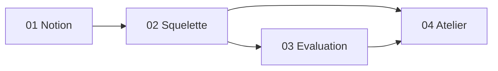

# Exercice — Création d'un agent (IA)

Parcours pédagogique pour comprendre ce qu'est un **agent** dans le contexte de l'IA, concevoir une fiche agent, et monter progressivement en complexité (chat → autorisations → lecture → écriture → orchestration → sub-agent).

Ce dossier est **autonome** : vous pouvez le suivre sans passer par le chat. Il s'appuie sur le dépôt [orchestrateur](../README.md) (catalogue, Builder, workflows).

---

## Public et durée indicative

| Profil | Parcours recommandé | Durée |
|--------|---------------------|-------|
| Découverte | L1 + L2 + QCM (partie 1) | ~1 h |
| Formation | L1 → L4 niveaux 0–4 | ~3 h |
| Avancé | Tout + niveaux 5–7 + questions ouvertes | ~5 h |

---

## Contenu du dossier

| Fichier | Rôle |
|---------|------|
| [01-notion-agent.md](./01-notion-agent.md) | Théorie : agent vs modèle, vs chat, vs workflow ; cartographie plateforme |
| [02-squelette-et-exemples.md](./02-squelette-et-exemples.md) | Gabarit JSON, checklist, exemples commentés |
| [03-evaluation-enonce.md](./03-evaluation-enonce.md) | QCM + questions libres (**élève / autonome**) |
| [03-evaluation-corrige.md](./03-evaluation-corrige.md) | Réponses et grilles (**formateur**) |
| [04-atelier-progressif.md](./04-atelier-progressif.md) | 8 niveaux de complexité, fil rouge documentation |
| [templates/](./templates/) | Fichiers JSON et matrice d'autorisations réutilisables |

---

## Fil rouge (recommandé)

Tous les exercices pratiques du [04-atelier-progressif.md](./04-atelier-progressif.md) tournent autour d'un même besoin métier :

> **Maintenir la documentation du dépôt après un changement technique** (nouveau service, endpoint retiré, renommage).

Les agents catalogue `doc_inventory`, `doc_sync` et `doc_qa` du workflow `documentation-steward` servent de **référence** ; vous produisez vos propres variantes.

---

## Prérequis techniques (optionnel)

Pour exécuter les niveaux 1+ dans la vraie stack :

1. Stack Docker : voir [README](../README.md) et [guide-builder](../docs/guide-builder-utilisation.md).
2. Lexique projet : [LEXICAL.md](../LEXICAL.md) (§ Agents, Outils, Handoff).
3. Parcours UI : [parcours-utilisateur.md](../docs/parcours-utilisateur.md) (différence **Parcours** vs **Orchestrateur local**).

---

## Ordre de lecture

1. Lire **01** et **02**.
2. Faire **03** (énoncé seul ; corrigé après coup ou avec le formateur).
3. Réaliser **04** niveau par niveau ; ne pas sauter les garde-fous.

---

## Références projet

| Sujet | Document |
|-------|----------|
| Équipes et workflows | [docs/agents.md](../docs/agents.md) |
| Builder (composition) | [docs/guide-builder-utilisation.md](../docs/guide-builder-utilisation.md) |
| Contrat agent | `backend/core/contracts.py` → `AgentDefinition` |
| Exemples catalogue | `catalog/agents/*.json` |
