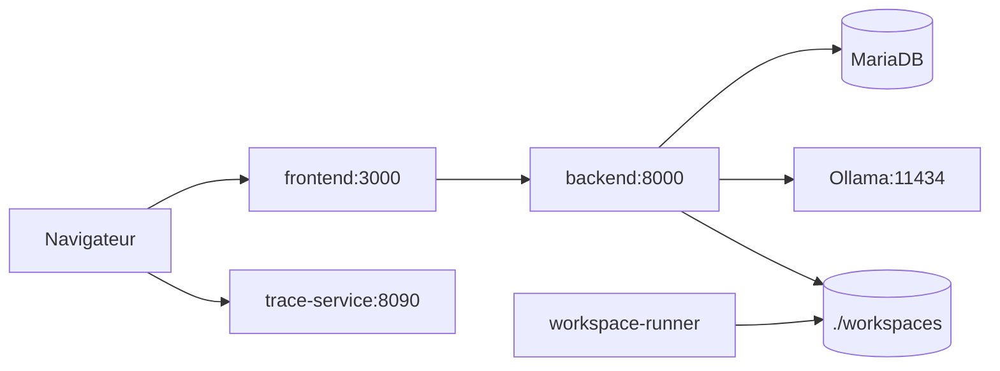

# Orchestrateur local multi-agents

Socle Python-first pour un orchestrateur multi-agents local, organise en **MVC** avec services Docker separes.

Le catalogue (`catalog/agents/`, `catalog/workflows/`) definit des **agents reutilisables** et des **workflows** (sequences d'etapes). L'UI permet de comparer deux equipes de developpement sur la meme fonctionnalite et de materialiser le resultat dans un **workspace disque executable**.

## Stack actuelle

| Service | Image / build | Role | Port hote |
|---------|---------------|------|-----------|
| `frontend` | `frontend/Dockerfile` (Ionic/React + nginx) | UI, benchmark, trace des livrables | 3000 |
| `backend` | `backend/Dockerfile` (FastAPI) | API, orchestration, agents in-process | 8000 |
| `trace-service` | `trace-service/Dockerfile` (FastAPI) | Traces conversationnelles (spans par phase) — SQLite persisté sous Docker (`trace_sqlite_data`) ; hors Compose, mémoire sauf `TRACE_SQLITE_PATH` ; aussi lançable en local (`pip install -e .`) | 8090 |
| `mcp-server` | `mcp-server/Dockerfile` (FastMCP + Streamable HTTP) | Pont MCP vers l'API (`/mcp`) | 8010 |
| `workspace-runner` | `workspace-runner/Dockerfile` (Python + pytest) | Rejouer tests / demos dans un environnement isole | — |
| `db` | `mariadb:11` | Catalogue agents / workflows (JSON en base) | 3306 |
| `ollama` | `ollama/ollama:latest` | Inference locale partagee | 11434 |
| `ollama-init` | `ollama/ollama:latest` | `ollama pull` du modele par defaut au demarrage | — |

Reseau Docker : `orchestrateur-agent-mesh` (`agent_mesh` dans `compose.yaml`).

Volume partage : `./workspaces` monte sur `backend` et `workspace-runner` (`WORKSPACE_ROOT=/workspaces`).

### Pipelines (catalogue)

Agents fonctionnels (pas de personas) ; execution via `POST /workflows/catalog/{workflow_id}` ou benchmark.

| Workflow | Etapes (resume) |
|----------|-----------------|
| **Legacy** `specification-team` | `plan` → `research` → `execute` → `verify` |
| **TDD** `team-tdd` | `write_tests` → `code_backend` → `code_frontend` → `integration` → `run_fix` → `document` |
| **Classique** `team-classic` | `schematic` → `api_contract` → `database` → `code_backend` → `code_frontend` → `test_and_verify` → `integration` → `run_fix` → `review` → `security` → `document` |
| **Documentation steward** `documentation-steward` | `doc_inventory` → `doc_sync` → `doc_qa` (alignement docs / code) |
| **Visualisation code** `team-code-viz` | `viz_code_scan` → `viz_structure` → `viz_uml` → `viz_drawio` → `viz_mermaid` → `viz_qa` |

**Benchmark** : `POST /workflows/dev-team-benchmark` execute `team-tdd` puis `team-classic` **sequentiellement** sur la meme demande (durees, succes, artefacts, workspace).

Runtime inference : **Ollama** (`MODEL_BACKEND=ollama`), un seul modele charge a la fois (`OLLAMA_MAX_LOADED_MODELS=1`, `OLLAMA_NUM_PARALLEL=1`).

Modele par defaut : **`qwen2.5-coder:1.5b`** (cible laptop **16 Go RAM**, workflows code / audit repo).

Documentation detaillee : [`docs/runtime.md`](docs/runtime.md), [`docs/models.md`](docs/models.md), [`docs/agents.md`](docs/agents.md), [`docs/sampling-runtime.md`](docs/sampling-runtime.md) (echantillonnage live, streaming, tokens BPE). Pont MCP (`stdio` / Streamable HTTP) : [`docs/mcp.md`](docs/mcp.md). Service **traces parcours utilisateur** (prototype) : [`docs/conversation-trace-service.md`](docs/conversation-trace-service.md).

## Architecture



- Le **backend** ecrit les livrables du benchmark et lance `pytest` pour le verdict automatique.
- Le **workspace-runner** partage le meme dossier : utile pour rejouer les tests dans un conteneur dedie sans melanger avec l'API.

## Demarrage Docker

```bash
docker compose up --build
```

- UI : http://localhost:3000
- API : http://localhost:8000
- MCP (Streamable HTTP) : http://localhost:8010/mcp
- Traces (onglet **Parcours**) : http://localhost:8090 (via `docker compose`, voir `trace-service/`)
- Ollama : http://localhost:11434

Copier `.env.example` vers `.env` pour surcharger le modele au demarrage :

```bash
cp .env.example .env
```

Variables utiles :

| Variable | Valeur par defaut | Description |
|----------|-------------------|-------------|
| `OLLAMA_DEFAULT_MODEL` | `qwen2.5-coder:1.5b` | Modele global et repli par etape pipeline |
| `OLLAMA_MODEL_*` | *(vide)* | Surcharge par runner (`write_tests`, `code_backend`, `plan`, …) |
| `WORKSPACE_ROOT` | `./workspaces` (local) / `/workspaces` (compose) | Racine des livrables benchmark |
| `CATALOG_BACKEND` | `mariadb` en compose | `file` pour dev local sans DB |
| `ORCHESTRATOR_CATALOG_ROOT` | `./catalog` | Catalogue fichier si `CATALOG_BACKEND=file` |
| `VITE_API_BASE_URL` | `http://localhost:8000` | URL API au build frontend |
| `VITE_TRACE_SERVICE_URL` | `http://127.0.0.1:8090` | URL trace-service au build (onglet **Parcours** ; machine hote, pas le reseau Docker interne) |
| `MCP_SERVER_PORT` | `8010` | Port hôte du serveur MCP (Compose) ; endpoint `http://localhost:<port>/mcp` |
| `ORCHESTRATOR_HTTP_TIMEOUT_SECONDS` | `600` (local) / `900` (Compose MCP) | Timeout HTTP côté pont MCP vers l’API (workflows longs) |
| `OLLAMA_MODELS_DIR` | `/ollama-models` (compose) | Acces aux blobs GGUF pour tokenisation BPE (`llama-cpp-python`) |

Reglages runtime persistants : `GET` / `PUT` `/v1/runtime/ollama/settings` (ou UI).

**Echantillonnage live** (UI onglet Echantillonnage) : essai streamé du profil live, calque de tokens (flux Ollama vs BPE modele). Voir [`docs/sampling-runtime.md`](docs/sampling-runtime.md).

## Workspaces executables

Lors d'un benchmark (`materialize_workspace: true` par defaut), chaque equipe obtient un sous-dossier :

```text
workspaces/
  20260518-120000-fizzbuzz/    # workspace_run_id
    team-tdd/
      src/ …
      tests/ …
      README.md
      docs/PIPELINE.md         # resumes des agents
    team-classic/
      …
```

- Objectif contenant **FizzBuzz** → projet Python runnable (implementation + tests pytest).
- Autre objectif → gabarit Python generique + trace pipeline.

### Executer localement (hors Docker)

```bash
cd workspaces/<run_id>/team-tdd
python -m venv .venv
.venv\Scripts\activate          # Windows
# source .venv/bin/activate   # Linux/macOS
pip install -r requirements.txt
pytest -q
python -m src.fizzbuzz        # si gabarit FizzBuzz
```

### Executer via workspace-runner (Docker)

Apres un benchmark, recuperer le `workspace_run_id` dans l'UI ou la reponse API.

**PowerShell :**

```powershell
.\scripts\workspace-test.ps1 -RunId 20260518-120000-fizzbuzz -Team team-tdd
.\scripts\workspace-test.ps1 -RunId 20260518-120000-fizzbuzz -Team team-tdd -RunDemo
```

**Bash :**

```bash
chmod +x scripts/workspace-test.sh
./scripts/workspace-test.sh --run-id 20260518-120000-fizzbuzz --team team-tdd
```

**Manuel :**

```bash
docker compose exec workspace-runner bash -lc "cd /workspaces/<run_id>/team-tdd && pytest -q"
```

Le dossier `workspaces/` est ignore par git (sauf `.gitkeep`) : les runs restent sur ta machine.

## Modeles Ollama (≤ 4B, 16 Go RAM)

Liste complete et profils : [`docs/models.md`](docs/models.md).

| Tag Ollama | Params | Usage recommande |
|------------|--------|------------------|
| **`qwen2.5-coder:1.5b`** | 1,5B | **Defaut actuel** — code, audit repo, execution |
| `qwen2.5:1.5b` | 1,5B | Plan / verify generiques, handoffs structures |
| `qwen2.5:3b` | 3B | Qualite generale si la RAM le permet |
| `qwen2.5-coder:3b` | 3B | Code / refactor plus exigeant |
| `qwen2.5:0.5b` | 0,5B | Validation plumbing uniquement (pas la qualite metier) |
| `llama3.2:3b` | 3B | Alternative generale |
| `gemma3:4b` | 4B | Meilleure qualite dans la limite 4B |
| `phi4-mini` | ~3,8B | Raisonnement, planification |
| `nemotron-mini:4b` | 4B | Function calling, RAG |
| `smollm2:1.7b` | 1,7B | Taches tres legeres, reponses rapides |

Exemple de montee en qualite par etape (toujours un modele charge a la fois) :

```env
OLLAMA_DEFAULT_MODEL=qwen2.5-coder:1.5b
OLLAMA_MODEL_PLAN=qwen2.5:1.5b
OLLAMA_MODEL_VERIFY=qwen2.5:1.5b
```

Telechargement manuel :

```bash
ollama pull qwen2.5-coder:1.5b
```

## Dev local (sans Docker)

```bash
pip install -e ".[dev]"
uvicorn app.main:app --reload --app-dir backend
```

Frontend :

```bash
cd frontend && npm install && npm run dev
```

Workspaces locaux : `WORKSPACE_ROOT=./workspaces` (defaut).

## Endpoints

- `GET /health`
- `GET /services/status`
- `GET /use-cases`
- `GET /teams` — equipes catalogue (`team-tdd`, `team-classic`)
- `GET /team?team_id=team-tdd`
- `GET/POST /v1/agents`, `GET/POST /v1/workflows` — definitions catalogue
- `POST /workflows/specification` — pipeline legacy
- `POST /workflows/catalog/{workflow_id}` — executer un workflow catalogue
- `POST /workflows/dev-team-benchmark` — compare TDD vs classique + workspace
- `POST /workflows/repo-audit`
- `GET/PUT /v1/runtime/ollama/settings`
- `GET/PUT /v1/runtime/sampling/settings` — profils orchestration + live
- `PUT /v1/runtime/sampling/settings/live` — mise a jour du profil live
- `POST /v1/runtime/sampling/preview` — essai bloquant
- `POST /v1/runtime/sampling/preview/stream` — essai streamé (NDJSON)
- `GET /v1/runtime/sampling/tokenize/capabilities` — source tokenizer BPE
- `POST /v1/runtime/sampling/tokenize` — tokenisation BPE du texte

Exemple benchmark :

```bash
curl -s -X POST http://localhost:8000/workflows/dev-team-benchmark \
  -H "Content-Type: application/json" \
  -d '{"objective":"Implementer FizzBuzz de 1 a 100","team_order":["team-tdd","team-classic"]}'
```

## Tests

```bash
pytest
```

## Backend MVC (`backend/app/`)

- **models** : schemas HTTP (`api_schemas.py`) et persistance
- **views** : routeurs FastAPI (`views/`)
- **controllers** : orchestration des cas d'usage (`controllers/`)
- **domain** : logique metier (`backend/core/`)
