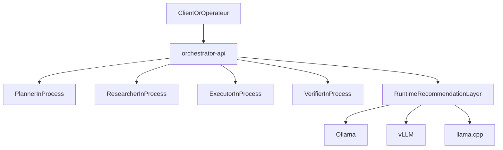

# Orchestrateur local multi-agents

Ce depot implemente un socle `Python-first` pour construire un orchestrateur multi-agents local avec une topologie volontairement simple.

L'architecture de demarrage suit maintenant cette approche:

- un orchestrateur central expose en `FastAPI`
- des roles `Planner`, `Researcher`, `Executor`, `Verifier` executes en interne a la demande
- un service `Ollama` separe pour l'inference locale
- une memoire partagee au niveau du workflow
- un coeur Python simple a faire evoluer
- des points d'extension futurs pour `TypeScript`, `Rust` et `C++`

## Architecture actuelle



## Recommandation de stack

- langage principal: `Python`
- orchestration et API: `FastAPI`
- execution locale simple: `Docker Compose`
- inference generaliste: `Ollama`
- inference haute cadence: `vLLM`
- compatibilite et quantisation: `llama.cpp`
- composants natifs plus tard: `Rust` ou `C++` apres profilage

## Equipe actuelle

La premiere equipe specialisee contient quatre roles:

1. `Planner`
2. `Researcher`
3. `Executor`
4. `Verifier`

Ces roles cooperent maintenant sur cinq cas d'usage:

1. transformer une demande floue en specification exploitable
2. benchmarker des modeles locaux
3. preparer un corpus pour fine-tuning ou RAG
4. produire un runbook operateur local et auditable
5. auditer un depot local en lecture seule avec preuves traceables

## V2 Repo Audit

La V2 ajoute un workflow `local-repo-audit` centre sur l'analyse d'un depot local.

Ce workflow:

- garde les quatre roles existants
- collecte des preuves deterministes via une couche `RepoCapabilities`
- produit un inventaire, des constats structures et un verdict de verification
- reste strictement en lecture seule

En mode local, l'API principale peut maintenant utiliser un vrai backend modele si `MODEL_BACKEND=ollama`.

## Demarrage recommande

Le chemin recommande passe par une stack Docker simplifiee:

- `orchestrator-api`
- `ollama`
- `ollama-init`

```bash
docker compose up --build
```

L'API principale est alors disponible sur `http://localhost:8000`.
L'API `Ollama` locale est exposee sur `http://localhost:11434`.

## Profil de validation leger

Pour valider le fonctionnement sur un laptop de `16 Go` de RAM, la stack utilise par defaut:

- `Ollama`
- le modele `qwen2.5:0.5b`

Ce modele est volontairement minuscule. Il ne sert pas a juger la qualite finale des agents, seulement a valider:

- le demarrage des services
- l'execution interne des roles
- les appels reels au runtime de modele
- les handoffs de bout en bout

Quand tu voudras monter en qualite, il suffira de changer la variable `OLLAMA_DEFAULT_MODEL`.
Une valeur d'exemple est fournie dans `.env.example`, avec:

- `MODEL_BACKEND=ollama`
- `OLLAMA_BASE_URL=http://localhost:11434`
- `OLLAMA_DEFAULT_MODEL=qwen2.5:0.5b`

## Endpoints utiles

- `GET /health`
- `GET /use-cases`
- `GET /team`
- `POST /runtime/recommendation`
- `POST /workflows/specification`
- `POST /workflows/repo-audit`

Exemple minimal pour le repo audit:

```bash
curl -X POST http://localhost:8000/workflows/repo-audit \
  -H "Content-Type: application/json" \
  -d '{
    "objective": "Auditer ce depot en lecture seule",
    "repo_path": ".",
    "analysis_axes": ["architecture", "docs", "dependencies"]
  }'
```

## Documentation

- [Vue d'architecture](docs/architecture.md)
- [Guide Docker](docs/docker-stack.md)
- [Equipe d'agents](docs/agents.md)
- [Runtime local et GPU](docs/runtime.md)
- [Operations et prochaines etapes](docs/operations.md)
