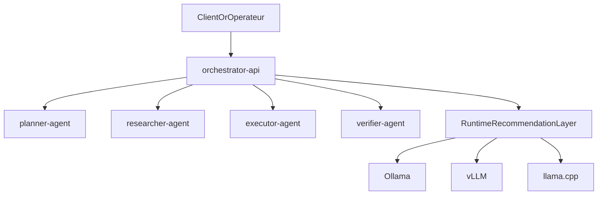

# Orchestrateur local multi-agents

Ce depot implemente un socle `Python-first` oriente `Docker-first` pour construire un orchestrateur multi-agents local.

L'architecture de demarrage suit une approche hybride pragmatique:

- un orchestrateur central expose en `FastAPI`
- un conteneur par agent specialise
- un service `Ollama` partage par les agents
- un reseau Docker interne pour les handoffs
- un coeur Python simple a faire evoluer
- des points d'extension futurs pour `TypeScript`, `Rust` et `C++`

## Architecture actuelle



## Recommandation de stack

- langage principal: `Python`
- orchestration et API: `FastAPI`
- execution locale simple: `Docker Compose`
- inference generaliste: `Ollama`
- inference haute cadence: `vLLM`
- compatibilite et quantisation: `llama.cpp`
- composants natifs plus tard: `Rust` ou `C++` apres profilage

## Equipe V1

La premiere equipe specialisee contient quatre roles:

1. `Planner`
2. `Researcher`
3. `Executor`
4. `Verifier`

Ces roles cooperent sur quatre cas d'usage:

1. transformer une demande floue en specification exploitable
2. benchmarker des modeles locaux
3. preparer un corpus pour fine-tuning ou RAG
4. produire un runbook operateur local et auditable

## Demarrage recommande

Le chemin recommande passe desormais par Docker, pas par un environnement virtuel.

```bash
docker compose up --build
```

L'API principale est alors disponible sur `http://localhost:8000`.
L'API `Ollama` locale est exposee sur `http://localhost:11434`.

## Profil de validation leger

Pour valider le fonctionnement sur un laptop de `16 Go` de RAM, la stack utilise par defaut:

- `Ollama`
- le modele `qwen2.5:0.5b`

Ce modele est volontairement minuscule. Il ne sert pas a juger la qualite finale des agents, seulement a valider:

- le demarrage des services
- la communication inter-conteneurs
- les appels reels au runtime de modele
- les handoffs de bout en bout

Quand tu voudras monter en qualite, il suffira de changer la variable `OLLAMA_DEFAULT_MODEL`.
Une valeur d'exemple est fournie dans `.env.example`, et `compose.yaml` utilise cette variable avec une valeur de repli.

## Endpoints utiles

- `GET /health`
- `GET /v1/use-cases`
- `GET /v1/team`
- `POST /v1/runtime/recommendation`
- `POST /v1/workflows/specification`

## Documentation

- [Vue d'architecture](docs/architecture.md)
- [Guide Docker](docs/docker-stack.md)
- [Equipe d'agents](docs/agents.md)
- [Runtime local et GPU](docs/runtime.md)
- [Operations et prochaines etapes](docs/operations.md)
