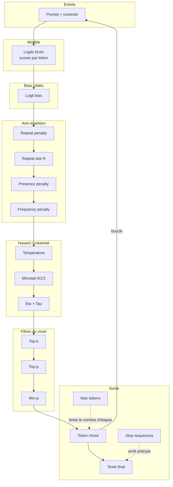
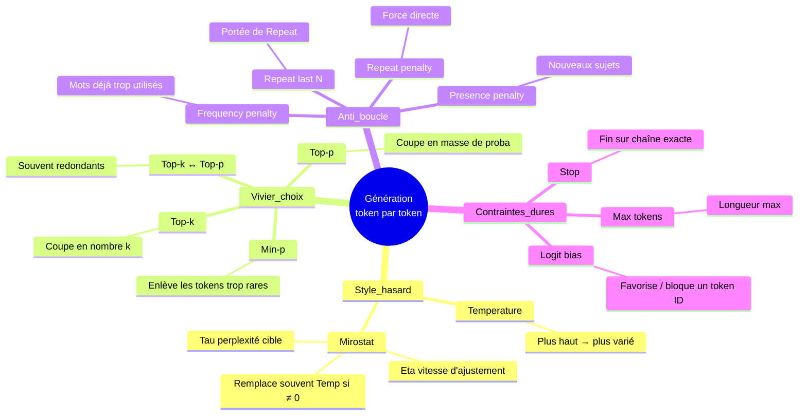
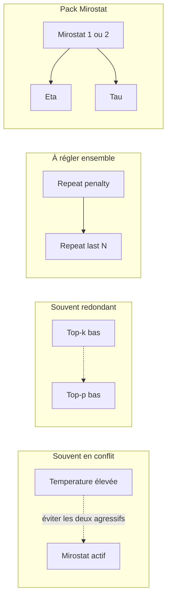

# Échantillonnage LLM (Ollama) — qui influence quoi ?

Guide de lecture des paramètres exposés dans l’écran **Échantillonnage live** de l’orchestrateur.  
Tous agissent **à chaque token généré**, sauf **Max tokens** et **Stop**, qui portent sur **la longueur** ou **la fin** de la réponse.

Paramètres couverts : Temperature, Top-k, Top-p, Min-p, Mirostat (+ Eta, Tau), Presence penalty, Frequency penalty, Repeat penalty, Repeat last N, Logit bias, Max tokens (num_predict), Stop sequences.

**Essai live et tokens** : pour observer la génération en direct et la découpe BPE du modèle, voir [`sampling-runtime.md`](./sampling-runtime.md).

---

## 1. Chaîne globale : qui influence quoi ?

À chaque étape, le modèle propose des scores pour tous les mots possibles ; les réglages **transforment** ces scores, **filtrent** les candidats, puis **tirent** le prochain mot.

**En bref :**

- **Logit bias** pousse ou freine des mots précis.
- **Pénalités** évitent les boucles et la lourdeur.
- **Température / Mirostat** décident à quel point on explore vs on reste « sûr ».
- **Top-k / Top-p / Min-p** réduisent la liste des mots encore possibles.
- **Max tokens** et **Stop** ne changent pas le « style » d’un mot, mais **combien** ou **quand** ça s’arrête.

---

## 2. Mind map des influences (relations)

---

## 3. Regroupement par rôle

*Critère : à quoi ça sert quand tu règles.*

| Groupe | Paramètres | Ce que tu ressens en sortie | Ordre conseillé pour régler |
|--------|------------|-----------------------------|------------------------------|
| **A. Longueur & fin** | Max tokens, Stop | Réponse courte/longue, s’arrête sur `END` etc. | 1er si tu veux juste borner la réponse |
| **B. Créativité globale** | Temperature **ou** Mirostat (+ Eta, Tau) | Froid/précis ↔ inventif/instable | 2e — **ne monte pas les deux en même temps** |
| **C. Vivier de mots** | Top-p (souvent suffisant), Top-k, Min-p | Moins de dérapages, moins de mots « bizarres » | 3e — 1 à 2 réglages, pas les 3 au max |
| **D. Anti-répétition** | Repeat penalty + Repeat last N, Presence, Frequency | Moins de « oui oui oui », moins de tics | 4e si le texte tourne en rond |
| **E. Chirurgie** | Logit bias | Forcer/interdire un token précis (rare en usage courant) | Dernier recours |

---

## 4. Regroupement par impact

*Critère : à quel point un petit changement se voit.*

| Impact | Paramètres | Pourquoi |
|--------|------------|----------|
| **Très fort** | Temperature, Top-p, Repeat penalty, Max tokens | Changent vite le ton, la diversité, les boucles ou la taille |
| **Fort** | Mirostat (+ Eta/Tau si Mirostat ≠ 0), Top-k, Min-p | Redéfinissent fortement le choix du prochain mot |
| **Moyen** | Presence / Frequency penalty, Repeat last N | Affinent surtout si répétitions gênantes |
| **Ciblé / faible en général** | Logit bias, Stop | Effet local (un mot, une coupure) |

---

## 5. Interactions importantes (éviter les pièges)

| Si tu… | Alors… |
|--------|--------|
| Actives **Mirostat** (1 ou 2) | **Temperature** compte moins ; joue sur **Tau** (cible) et **Eta** (réactivité). |
| Baisses **Top-p** *et* **Top-k** *et* **Min-p** | Réponse souvent **plate ou répétitive** → préfère **Top-p ≈ 0,9** seul au début. |
| Montes **Repeat penalty** sans **Repeat last N** | Effet imprévisible : N dit **sur combien de tokens** on regarde en arrière. |
| **Presence** vs **Frequency** | Presence = « ce **sujet** est-il déjà passé ? » ; Frequency = « ce **mot** est-il trop souvent là ? » |

---

## 6. Carte rapide « métaphore »

| Paramètre | Image mentale |
|-----------|----------------|
| **Temperature** | Thermostat du hasard : froid = même réponse à chaque fois |
| **Top-k** | Menu du jour limité aux **k** plats les plus probables |
| **Top-p** | On garde les plats jusqu’à **p %** de la « popularité » cumulée |
| **Min-p** | On retire les plats trop improbables |
| **Mirostat** | Pilote auto qui vise une « surprise » constante (perplexité) |
| **Repeat penalty** | Amende si on vient de redire la même chose |
| **Repeat last N** | Taille de la fenêtre « mémoire » pour cette amende |
| **Presence penalty** | Bonus pour aborder de **nouveaux** thèmes |
| **Frequency penalty** | Amende si un **mot** revient trop souvent |
| **Logit bias** | Potard sur un mot précis du clavier |
| **Max tokens** | Compteur de mots max |
| **Stop** | Mot-clé qui déclenche la fin |

---

## 7. Parcours pratique

1. **Fixe le cadre** : Max tokens + Stop si besoin.
2. **Choisis un levier de style** : *soit* Temperature *soit* Mirostat (pas les deux au maximum).
3. **Stabilise** : Top-p seul (ex. 0,85–0,95) avant d’ajouter Top-k ou Min-p.
4. **Si ça boucle** : Repeat penalty + Repeat last N, puis Presence/Frequency si besoin.
5. **Logit bias** : seulement pour un cas précis (format, token interdit).

---

## 8. Rappel des libellés dans l’UI

| Clé technique | Libellé UI |
|---------------|------------|
| `temperature` | Temperature |
| `top_k` | Top-k |
| `top_p` | Top-p (nucleus) |
| `min_p` | Min-p |
| `mirostat` | Mirostat (0, 1 ou 2) |
| `mirostat_eta` | Mirostat eta |
| `mirostat_tau` | Mirostat tau |
| `presence_penalty` | Presence penalty |
| `frequency_penalty` | Frequency penalty |
| `repeat_penalty` | Repeat penalty |
| `repeat_last_n` | Repeat last N |
| `num_predict` | Max tokens (num_predict) |
| `stop` | Stop sequences |
| `logit_bias` | Logit bias |

---

*Document généré pour le projet orchestrateur — profil live Ollama.*

**Voir aussi** : [Module Cours (théorie ↔ réglages)](./cours-echantillonnage.md) · UI : onglet Échantillonnage → **Cours**.
