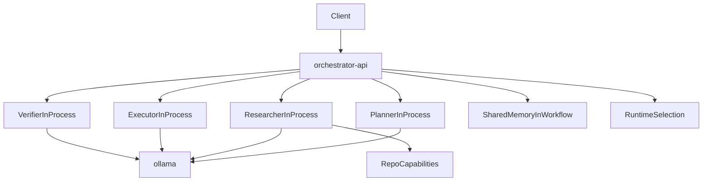

# Vue d'architecture

## Objectif

Cette base etablit une architecture multi-agents locale, simple a demarrer, sans partir trop tot dans une complexite distribuee excessive.

**Cas d'usage courants** (voir `backend/core/orchestrator.py`, routes sous `backend/app/views/`) :

- **`local-repo-audit`** — audit de depot en lecture seule, `POST /workflows/repo-audit`
- **`dev-team-benchmark`** — comparaison `team-tdd` vs `team-classic`, workspace disque
- **Workflows catalogue** — `POST /workflows/catalog/{workflow_id}` (`catalog/workflows/*.json` synchronise en base selon config)
- **Pipeline legacy specification** — `POST /workflows/specification` (`plan` → `research` → `execute` → `verify`)

Le principe retenu est:

- `Python` comme langage principal
- `FastAPI` comme plan de controle (`backend/app/`)
- un orchestrateur central qui sequence les handoffs
- une execution de roles en interne dans le processus du backend
- un runtime `Ollama` partage pour la validation fonctionnelle
- une couche de capacites repo en lecture seule pour l'audit local

## Pourquoi cette architecture

Cette structure repond bien a ton besoin:

- l'orchestrateur reste le point unique de pilotage
- les handoffs deviennent visibles et testables
- l'architecture reste locale, legere et robuste
- une evolution vers des services separes reste possible plus tard si necessaire

## Topologie logique

Schema simplifie : les equipes **dev** (`team-tdd`, `team-classic`) s'appuient sur d'autres *step ids* et labels moteur (`backend/core/pipeline.py`, `catalog/workflows/`), mais l'idee « orchestrateur in-process + Ollama + memoire de workflow » reste la meme.

## Workflow `local-repo-audit`

Le cas d'usage **`local-repo-audit`** (identifiant `use_case_id` dans les contrats) reprend exactement l'enchainement **`plan` → `research` → `execute` → `verify`** defini par `PIPELINE_STEP_IDS` dans `backend/core/pipeline.py`. Ce n'est pas un quatrieme pipeline parallele : ce sont les memes quatre etapes que le workflow specification legacy ; le code des roles branche une logique **audit** (lecture seule, inventaire, preuves, validation) lorsque le contexte porte `repo_audit`.

1. **`plan`** (Planner) — cadre le scope, les limites de lecture et le plan de recherche
2. **`research`** (Researcher) — lit le depot via `RepoCapabilities`, produit inventaire et preuves bornees
3. **`execute`** (Executor) — transforme les preuves en constats structures (`findings`)
4. **`verify`** (Verifier) — couverture, presence des preuves, respect du mode lecture seule

Endpoint HTTP : **`POST /workflows/repo-audit`**. Exemple de corps : [`operations.md`](./operations.md).

## Responsabilites des dossiers

- `backend/app/` : API FastAPI MVC (router, controllers, injection)
- `backend/core/` : contrats, memoire, roles, orchestration, gateway locale
- `backend/serve/` : CLI client HTTP, recommandation de runtime local
- `api/` : point d'entree historique re-exportant `app.main` (compatibilite)
- `catalog/` : definitions JSON agents / workflows (source du catalogue fichier)
- [`docs/parcours-utilisateur.md`](parcours-utilisateur.md) : **flux UI** (onglet Parcours vs Orchestrateur local, question → réponse)
- [`docs/guide-builder-utilisation.md`](guide-builder-utilisation.md) : **guide utilisateur** (catalogue builder, API curl, dépannage)
- [`docs/builder-catalog.md`](builder-catalog.md) : module builder (schéma SQL, SemVer, référence API `/builder`)
- `frontend/` : UI operateur Ionic / React
- `mcp-server/` : pont MCP (Streamable HTTP) vers l'API
- `trace-service/` : prototype de traces conversationnelles (service **trace-service** dans `compose.yaml`, port **8090**)
- `tests/` : verification des workflows et de l'API
- `docker/` : images de base partagees (`Dockerfile.python`)
- `docs/` : documentation operatoire et d'architecture
- `native/` : reserve a des modules `Rust` ou `C++` futurs

## Choix de conception importants

### Orchestrateur central

Pour le pipeline **legacy** (`PIPELINE_STEP_IDS`), l'orchestrateur sequence explicitement :

1. `plan` (Planner)
2. `research` (Researcher)
3. `execute` (Executor)
4. `verify` (Verifier)

Les workflows **catalogue dev** (`team-tdd`, `team-classic`) enchainent d'autres etapes ; voir `catalog/workflows/*.json` et [`agents.md`](./agents.md).

Ce decoupage simplifie :

- la trace d'execution sur le pipeline lineaire
- la debogabilite
- la maitrise des garde-fous
- l'introduction progressive de branches ou boucles plus tard

### Roles internes

Les roles rattaches aux etapes tournent par defaut **dans le meme processus** que le backend. Cela permet:

- de reduire le nombre de conteneurs a maintenir
- de limiter la latence et la complexite reseau
- de garder la logique metier testable et bien separee par etape / equipe

Le mode HTTP multi-services peut rester disponible comme compatibilite ou option d'evolution future.

### Memoire centralisee au niveau workflow

La memoire reste geree au niveau de l'orchestrateur pour chaque workflow. Les roles recoivent un snapshot, produisent leur sortie, puis renvoient un nouvel etat.

Ce compromis est volontaire:

- simple a comprendre
- facile a tester
- compatible avec un futur backend de memoire partagee

Pour **`local-repo-audit`**, cette memoire transporte notamment :

- l'inventaire du depot
- les preuves collectees
- les evenements de capacites invoquees
- le rapport de verification final

## Evolution prevue

Les evolutions naturelles de cette base sont:

- conserver `Ollama` pour la validation puis changer de modele ou de runtime
- etendre l'audit local a un repo monte explicitement en mode Docker
- brancher un stockage de traces et d'observabilite (voir [`conversation-trace-service.md`](./conversation-trace-service.md) et le paquet `trace-service/`)
- reintroduire des services separes si le parallelisme ou l'isolation deviennent necessaires
- introduire une vraie memoire partagee externe
- enrichir l'UI operateur (`frontend/`) : parcours, observabilite, operateur terrain
