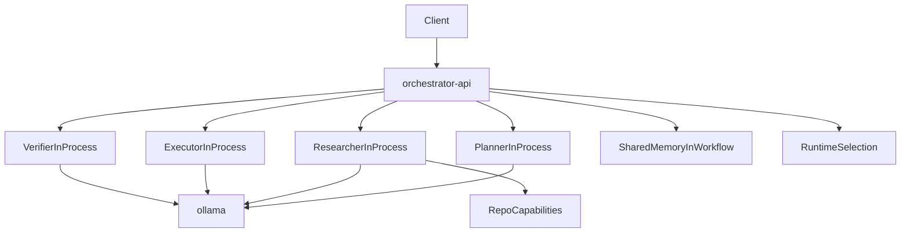

# Vue d'architecture

## Objectif

Cette base etablit une architecture multi-agents locale, simple a demarrer, sans partir trop tot dans une complexite distribuee excessive.

La V2 ajoute un workflow `local-repo-audit` en lecture seule pour auditer un depot local avec preuves traceables.

Le principe retenu est:

- `Python` comme langage principal
- `FastAPI` comme plan de controle
- un orchestrateur central qui sequence les handoffs
- une execution de roles en interne dans le processus de l'orchestrateur
- un runtime `Ollama` partage pour la validation fonctionnelle
- une couche de capacites repo en lecture seule pour l'audit local

## Pourquoi cette architecture

Cette structure repond bien a ton besoin:

- l'orchestrateur reste le point unique de pilotage
- les handoffs deviennent visibles et testables
- l'architecture reste locale, legere et robuste
- une evolution vers des services separes reste possible plus tard si necessaire

## Topologie logique

## Workflow repo audit

Le nouveau flux `local-repo-audit` garde les memes roles, mais specialise leurs sorties:

1. `Planner` cadre le scope, les limites de lecture et le plan de recherche
2. `Researcher` lit le depot via `RepoCapabilities` et collecte des preuves bornees
3. `Executor` transforme ces preuves en constats structures
4. `Verifier` controle la couverture, la presence des preuves et le respect du mode lecture seule

## Responsabilites des dossiers

- `api/`: points d'entree HTTP du control plane
- `core/`: contrats, memoire, roles, orchestration, gateway locale ou reseau
- `serve/`: logique de recommandation de runtime local
- `tests/`: verification du workflow et du choix de runtime
- `docker/`: image de base Python pour l'orchestrateur et les utilitaires de stack
- `docs/`: documentation operatoire et d'architecture
- `ui/`: reserve a une interface TypeScript future
- `native/`: reserve a des modules `Rust` ou `C++` futurs

## Choix de conception importants

### Orchestrateur central

L'orchestrateur sequence explicitement les roles dans l'ordre:

1. `Planner`
2. `Researcher`
3. `Executor`
4. `Verifier`

Ce choix simplifie:

- la trace d'execution
- la debogabilite
- la maitrise des garde-fous
- l'introduction progressive de branches ou boucles plus tard

### Roles internes

Les roles `Planner`, `Researcher`, `Executor` et `Verifier` tournent par defaut dans le meme processus que l'orchestrateur. Cela permet:

- de reduire le nombre de conteneurs a maintenir
- de limiter la latence et la complexite reseau
- de garder la logique metier testable et bien separee par role

Le mode HTTP multi-services peut rester disponible comme compatibilite ou option d'evolution future.

### Memoire centralisee au niveau workflow

La memoire reste geree au niveau de l'orchestrateur pour chaque workflow. Les roles recoivent un snapshot, produisent leur sortie, puis renvoient un nouvel etat.

Ce compromis est volontaire:

- simple a comprendre
- facile a tester
- compatible avec un futur backend de memoire partagee

Dans le workflow repo audit, cette memoire transporte aussi:

- l'inventaire du depot
- les preuves collectees
- les evenements de capacites invoquees
- le rapport de verification final

## Evolution prevue

Les evolutions naturelles de cette base sont:

- conserver `Ollama` pour la validation puis changer de modele ou de runtime
- etendre l'audit local a un repo monte explicitement en mode Docker
- brancher un stockage de traces et d'observabilite
- reintroduire des services separes si le parallelisme ou l'isolation deviennent necessaires
- introduire une vraie memoire partagee externe
- ajouter une interface operateur en `TypeScript`
