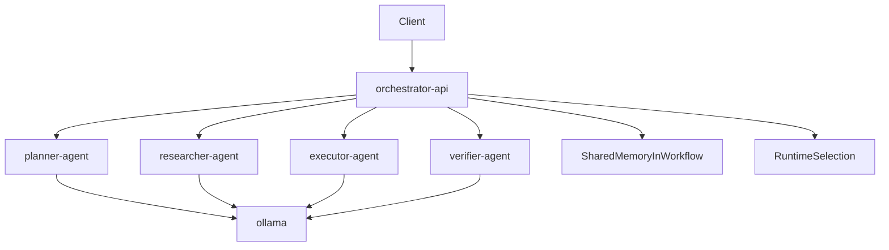

# Vue d'architecture

## Objectif

Cette V1 etablit une architecture multi-agents locale, conteneurisee, specialisee par role, sans partir trop tot dans une complexite distribuee excessive.

Le principe retenu est:

- `Python` comme langage principal
- `FastAPI` comme plan de controle
- un reseau `Docker` interne pour isoler les agents
- un orchestrateur central qui sequence les handoffs
- une execution d'agents en services HTTP distincts
- un runtime `Ollama` partage pour la validation fonctionnelle

## Pourquoi cette architecture

Cette structure repond bien a ton besoin:

- chaque agent peut avoir son image, ses dependances et ses ressources plus tard
- l'orchestrateur reste le point unique de pilotage
- les handoffs deviennent visibles et testables
- l'architecture peut rester locale tout en ressemblant a une topologie de production

## Topologie logique

## Responsabilites des dossiers

- `api/`: points d'entree HTTP du control plane et des services d'agents
- `core/`: contrats, memoire, roles, orchestration, gateway locale ou reseau
- `serve/`: logique de recommandation de runtime local
- `tests/`: verification du workflow et du choix de runtime
- `docker/`: image de base Python pour tous les services
- `docs/`: documentation operatoire et d'architecture
- `ui/`: reserve a une interface TypeScript future
- `native/`: reserve a des modules `Rust` ou `C++` futurs

## Choix de conception importants

### Orchestrateur central

L'orchestrateur sequence explicitement les roles dans l'ordre:

1. `Planner`
2. `Researcher`
3. `Executor`
4. `Verifier`

Ce choix simplifie:

- la trace d'execution
- la debogabilite
- la maitrise des garde-fous
- l'introduction progressive de branches ou boucles plus tard

### Agents isoles

Chaque agent est expose comme service HTTP dedie. Cela permet plus tard:

- de changer un agent sans redeployer toute la stack
- d'attacher des ressources ou variables d'environnement specifiques
- d'ajouter des outils ou permissions differents par role

### Memoire centralisee au niveau workflow

La memoire reste geree par l'orchestrateur dans cette V1. Les services d'agents recoivent un snapshot, produisent leur sortie, puis renvoient un nouvel etat.

Ce compromis est volontaire:

- simple a comprendre
- facile a tester
- compatible avec un futur backend de memoire partagee

## Evolution prevue

Les evolutions naturelles de cette base sont:

- conserver `Ollama` pour la validation puis changer de modele ou de runtime
- brancher un stockage de traces et d'observabilite
- separer les images Docker par famille d'agents
- introduire une vraie memoire partagee externe
- ajouter une interface operateur en `TypeScript`
