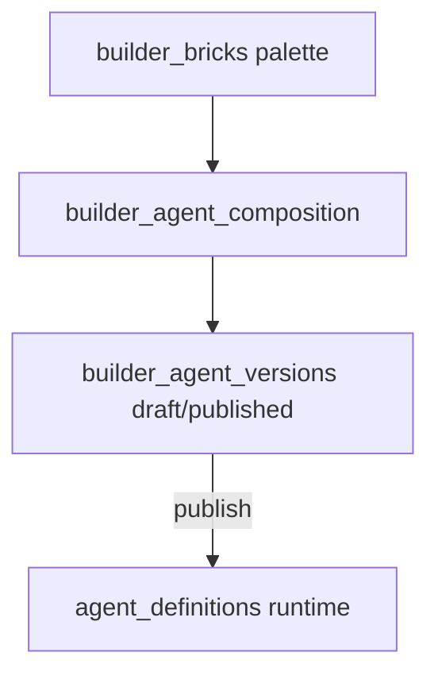

# Builder catalogue — schéma, SemVer et API

> **Guide pratique (UI + curl, parcours pas à pas)** : [`guide-builder-utilisation.md`](guide-builder-utilisation.md)

Module backend pour composer des **agents** et **workflows** à partir d'une palette de briques (`builder_bricks`), avec brouillons, validation humaine, agents custom et traçabilité complète.

Les fichiers `catalog/*.json` restent la **source de vérité** jusqu'au seeder complet ; la publication matérialise encore `agent_definitions` / `workflow_definitions` (runtime).

## Renommage validé (point 1)

| Nom design initial | Table implémentée | Note |
|--------------------|-------------------|------|
| `ref_bricks` | **`builder_bricks`** | Renommage explicite validé |
| `ref_domains` | `builder_domains` | Préfixe module |
| `ref_brick_types` | `builder_brick_types` | |
| `catalog_agents` | **`builder_agents`** | Évite la confusion avec `agent_definitions` |
| `catalog_promotion_requests` | **`builder_promotion_requests`** | v1 |

Toutes les tables du module portent le préfixe **`builder_`**.

## Migration SQL

- Fichier : [`db/002_builder.sql`](../db/002_builder.sql)
- Monté dans Docker après [`db/init.sql`](../db/init.sql) via `compose.yaml`
- Base existante : le script `02-builder.sql` **ne s'exécute pas** sur un volume déjà créé — appliquer à la main :

```powershell
Get-Content db\002_builder.sql | docker exec -i orchestrateur-db mariadb -u orchestrateur -porchestrateur orchestrateur
```

Sans cette étape, `/builder/bricks` renvoie **500** (`Table 'builder_bricks' doesn't exist`).

## Politique SemVer (`MAJOR.MINOR.PATCH`)

S'applique à `builder_agent_versions`, `builder_workflow_versions`, `builder_custom_*_versions` et `builder_brick_versions`.

### Agents (`builder_agent_versions`)

| Bump | Quand |
|------|--------|
| **PATCH** | Même composition de briques (`brick_id` par slot) ; changement cosmétique (`label`, typo `mission`, `changelog`) |
| **MINOR** | Brique ajoutée ou retrait non bloquant ; `runner_role` ajouté ; garde-fous renforcés sans changer le contrat entrées/sorties |
| **MAJOR** | Slot retiré ; entrée/sortie supprimée ou slug brique changé ; `runner_role` remplacé ; mission qui change le périmètre |

### Workflows (`builder_workflow_versions`)

| Bump | Quand |
|------|--------|
| **PATCH** | Textes (`goal`, `constraints`, `success_criteria`, `context`) sans changement de graphe |
| **MINOR** | Nouvelle étape compatible ; framework ajouté |
| **MAJOR** | Étape supprimée/réordonnée ; `depends_on` publié modifié ; `agent_definition_id` d'une étape changé |

### Briques (`builder_brick_versions`)

Version indépendante de celle de l'agent. Un agent en PATCH peut garder les mêmes `brick_id` même si la brique passe en `1.0.1` (label seul).

### Publication

- Une seule version **`published`** active par `agent_id` / `workflow_id` (contrôle applicatif).
- `runner_role` NULL → `default_runner = catalog_generic` à la publication.
- UPSERT vers `agent_definitions` / `workflow_definitions`.

Version initiale import catalogue : **`1.0.0`**.

## Rôles d'accès

| Acteur | Briques / catalogue | Pending | Publish | Custom / promote |
|--------|---------------------|---------|---------|------------------|
| Humain | R/W/D | approve/reject | oui | oui |
| LLM | lecture seule | création proposals | non | non |

## Couches de données



## Pending — granularité champ

- `builder_pending_brick_proposals.field_path` : ex. `label`, `facet_capability`, `metadata.tags`
- `builder_pending_agent_field_proposals.field_path` : ex. `mission`, `payload.capabilities[2]`

## API (`/builder`)

| Méthode | Path | Acteur |
|---------|------|--------|
| GET | `/builder/bricks` | H, LLM |
| GET | `/builder/bricks/{brick_id}` | H, LLM |
| POST | `/builder/bricks` | H |
| GET | `/builder/catalog/agents` | H, LLM |
| GET | `/builder/catalog/workflows` | H, LLM |
| GET | `/builder/catalog/agents/{agent_id}/versions` | H, LLM |
| POST | `/builder/compose/agents/draft` | H |
| POST | `/builder/compose/agents/versions/{version_id}/publish` | H |
| POST | `/builder/compose/workflows/draft` | H |
| POST | `/builder/compose/workflows/versions/{version_id}/publish` | H |
| POST | `/builder/compose/custom-agents/draft` | H |
| GET | `/builder/compose/custom-agents` | H |
| GET | `/builder/pending/bricks` | H |
| POST | `/builder/pending/bricks` | LLM (ou H) |
| POST | `/builder/pending/bricks/{id}/approve` | H (merge champ) |
| POST | `/builder/pending/bricks/{id}/reject` | H |
| GET | `/builder/pending/agents` | H |
| POST | `/builder/pending/agents` | LLM |
| POST | `/builder/pending/agents/{id}/approve` | H |
| POST | `/builder/pending/agents/{id}/reject` | H |
| POST | `/builder/compose/custom-agents/versions/{id}/publish` | H → runtime `custom-{slug}` |
| POST | `/builder/compose/custom-workflows/draft` | H |
| POST | `/builder/compose/custom-workflows/versions/{id}/publish` | H → runtime `custom-wf-{slug}` |
| GET | `/builder/compose/custom-workflows` | H |
| GET | `/builder/promotions` | H |
| POST | `/builder/promotions` | H |
| POST | `/builder/promotions/{id}/approve` | H |
| POST | `/builder/promotions/{id}/reject` | H |
| POST | `/builder/sessions` | H, LLM |
| GET | `/builder/sessions/{session_id}` | H |
| GET | `/builder/audit` | H |

**UI** : onglet **Catalogue builder** (5 étapes : Palette → Composer → Publier → Promouvoir → Validation). Voir le [guide d'utilisation](guide-builder-utilisation.md).

`approve` briques : `label`, `description`, `metadata.*`. `approve` agents : `mission`, `name`, `business_role`, `runner_role`, listes (`capabilities`, etc.).

Publication catalogue : UPSERT `agent_definitions` / `workflow_definitions`. Custom : id runtime `custom-{slug}` / `custom-wf-{slug}` (privé jusqu’à promotion).

Promotion `custom_agent` → `builder_agent` : copie composition publiée + entrée catalogue + `promotion_status=promoted`.

## Seeder

```bash
# Depuis la racine du dépôt, avec DATABASE_URL défini
python -m core.builder.seed
```

Phases : S1 import `catalog/agents` + `catalog/workflows` ; S2 runners ; S3 briques génériques domaine `refactor` (partiel).

## Référence contrats Pydantic

- Agent publié : `AgentDefinition` — [`backend/core/contracts.py`](../backend/core/contracts.py)
- Workflow publié : `WorkflowDefinition`
- Runtime : tables `agent_definitions`, `workflow_definitions`
