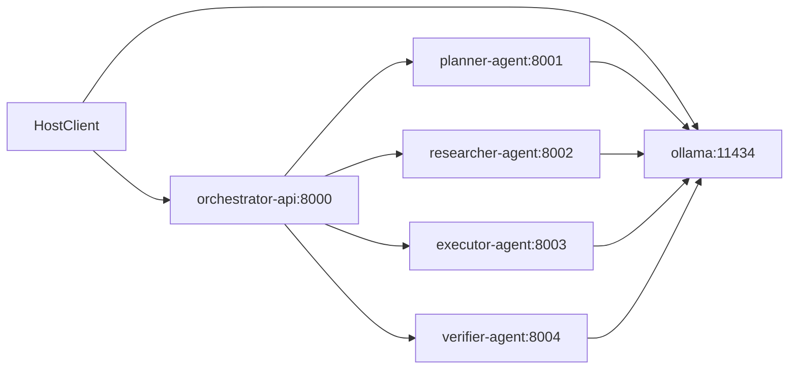

# Guide Docker

## Philosophie

Le depot est maintenant pense pour demarrer via `Docker Compose`.

Le reseau `orchestrateur-agent-mesh` joue le role de backbone local:

- l'API centrale y dialogue avec les agents
- les agents partagent un service `Ollama`
- les agents ne sont pas exposes publiquement
- seul `orchestrator-api` publie un port vers l'hote

## Services

### `orchestrator-api`

Responsabilites:

- exposer l'API publique
- choisir entre gateway locale et gateway HTTP
- piloter l'ordre des handoffs
- centraliser la memoire de workflow

Port expose:

- `8000`

### `ollama`

Responsabilites:

- exposer l'API de generation locale
- charger les modeles utilises par les agents
- rester partage entre tous les services

Port expose:

- `11434`

### `ollama-init`

Responsabilites:

- attendre que `ollama` soit disponible
- telecharger le modele par defaut
- rendre la stack directement testable

Dans la configuration actuelle, le modele initialise automatiquement est:

- `qwen2.5:0.5b`

### `planner-agent`

Responsabilites:

- cadrer la demande
- decomposer en etapes
- produire le brief initial

Port interne:

- `8001`

### `researcher-agent`

Responsabilites:

- trouver les inconnues
- formuler les preuves attendues
- enrichir le contexte de decision

Port interne:

- `8002`

### `executor-agent`

Responsabilites:

- produire le livrable operationnel
- structurer l'ordre d'execution
- fournir checklist et notes operateur

Port interne:

- `8003`

### `verifier-agent`

Responsabilites:

- verifier les criteres de succes
- controler les garde-fous
- emettre un verdict `go/no-go`

Port interne:

- `8004`

## Demarrage

Depuis la racine du depot:

```bash
docker compose up --build
```

Pour lancer en arriere-plan:

```bash
docker compose up --build -d
```

Pour arreter:

```bash
docker compose down
```

## Flux reseau



## Pourquoi utiliser un seul service `Ollama` partage au debut

Pour la validation fonctionnelle, un seul runtime de modele partage est preferable:

- plus simple a exploiter
- moins gourmand en RAM
- plus rapide a valider sur un laptop
- plus facile a remplacer plus tard

Quand tu voudras specialiser davantage, tu pourras:

- changer le modele global `OLLAMA_DEFAULT_MODEL`
- definir un modele par role
- ou separer certains agents vers leur propre runtime

## Recommandation pour ton contexte

Comme tu es sur Windows et que la cible exacte reste ouverte, la bonne base est:

- `Docker Desktop` ou `WSL2 + Docker`
- services Python isoles par role
- `Ollama` partage avec un modele ultra-compact pour valider le plumbing

Si tu passes plus tard sur une machine Linux GPU dediee, la topologie restera compatible.
