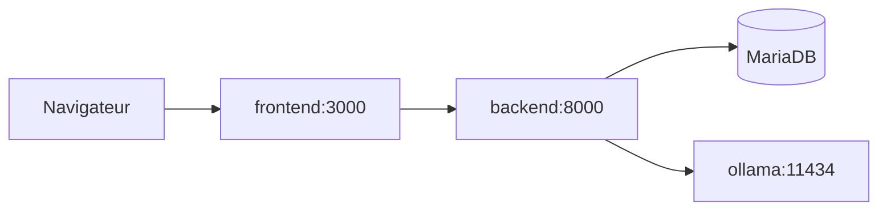

# Guide Docker

## Philosophie

Le depot demarre via `Docker Compose` avec un reseau interne `orchestrateur-agent-mesh`.

- le **backend** orchestre les quatre roles in-process
- **Ollama** est partage pour l'inference
- seuls **frontend**, **backend** et **ollama** exposent des ports vers l'hote

## Services (`compose.yaml`)

### `frontend`

- UI Ionic/React servie par nginx
- Port hote : **3000**

### `backend`

- API FastAPI (MVC), pipeline `plan` → `research` → `execute` → `verify`
- Port hote : **8000**
- Variables : `MODEL_BACKEND=ollama`, `OLLAMA_BASE_URL=http://ollama:11434`

### `db`

- MariaDB 11, catalogue agents / workflows
- Port hote : **3306** (non requis pour l'UI seule)

### `ollama`

- Runtime d'inference local
- Port hote : **11434**
- Limites : `OLLAMA_NUM_PARALLEL=1`, `OLLAMA_MAX_LOADED_MODELS=1`

### `ollama-init`

- Attend qu'`ollama` soit healthy
- Execute `ollama pull` sur le modele par defaut
- Modele initialise : **`qwen2.5-coder:1.5b`** (surcharge via `OLLAMA_DEFAULT_MODEL`)

## Demarrage

```bash
docker compose up --build
```

Arriere-plan :

```bash
docker compose up --build -d
```

Arret :

```bash
docker compose down
```

## Flux reseau



## Modeles

Voir [`models.md`](models.md) pour le catalogue et les surcharges par etape pipeline.

## Evolution future

La topologie peut evoluer vers des agents dans des conteneurs separes ; l'orchestrateur actuel garde les roles dans le backend pour simplifier les handoffs et les tests.
