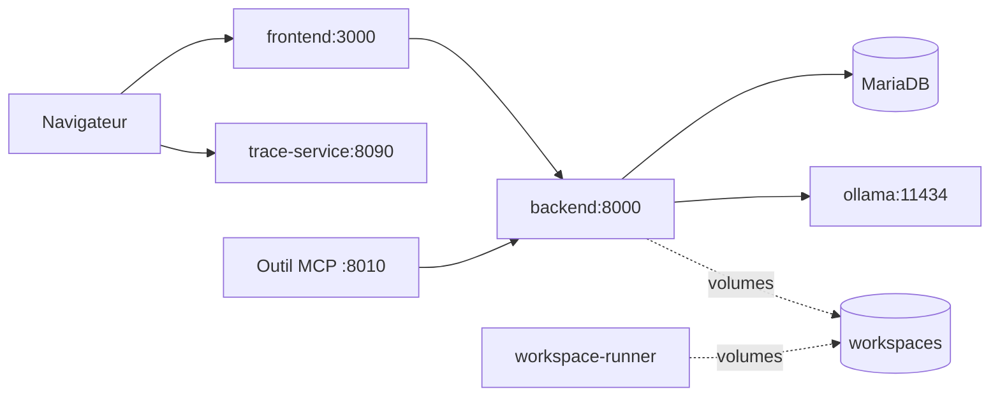

# Guide Docker

## Philosophie

Le depot demarre via `Docker Compose` avec un reseau interne `orchestrateur-agent-mesh`.

- le **backend** orchestre les roles in-process (pipeline legacy en quatre etapes ; workflows catalogue varies)
- **Ollama** est partage pour l'inference
- ports **vers l'hote** (par defaut dans `compose.yaml`) : **3000** (frontend), **8000** (backend), **8090** (trace-service), **8010** (mcp-server), **3306** (MariaDB), **11434** (Ollama) ; `workspace-runner` n'expose pas de port

## Services (`compose.yaml`)

### `frontend`

- UI Ionic/React servie par nginx
- Port hote : **3000**

### `backend`

- API FastAPI (MVC) ; pipeline lineaire historique en quatre etapes `plan` → `research` → `execute` → `verify` ; autres enchainements via workflows catalogue (`POST /workflows/catalog/...`)
- Port hote : **8000**
- Variables : `MODEL_BACKEND=ollama`, `OLLAMA_BASE_URL=http://ollama:11434`

### `db`

- MariaDB 11, catalogue agents / workflows
- Port hote : **3306** (non requis pour l'UI seule)

### `ollama`

- Runtime d'inference local
- Port hote : **11434**
- Limites : `OLLAMA_NUM_PARALLEL=1`, `OLLAMA_MAX_LOADED_MODELS=1`

### `ollama-init`

- Attend qu'`ollama` soit healthy
- Execute `ollama pull` sur le modele par defaut
- Modele initialise : **`qwen2.5-coder:1.5b`** (surcharge via `OLLAMA_DEFAULT_MODEL`)

### `trace-service`

- API FastAPI minimale : traces + spans (voir [`conversation-trace-service.md`](conversation-trace-service.md))
- Port hote : **8090**
- Variables : `TRACE_CORS_ORIGINS` (origines navigateur, ex. `http://localhost:3000`), `TRACE_BIND_HOST` (defaut `0.0.0.0` dans l'image), `TRACE_PORT`, `TRACE_SQLITE_PATH` (defaut compose : `/data/traces.sqlite` sur le volume `trace_sqlite_data`)
- Sante : `GET http://localhost:8090/health`
- Le **navigateur** appelle ce service directement (URL figee au build du frontend : `VITE_TRACE_SERVICE_URL`, defaut `http://127.0.0.1:8090` avec le port publie)

### `mcp-server`

- Pont MCP vers l'API backend (`ORCHESTRATOR_API_BASE`)
- Port hote : **8010** (surcharge via `MCP_SERVER_PORT`)
- Sante : `GET http://localhost:8010/healthz` (depuis l'hote)

### `workspace-runner`

- Environnement pour rejouer tests / demos sur `./workspaces` (pas de port publié)

## Demarrage

```bash
docker compose up --build
```

Arriere-plan :

```bash
docker compose up --build -d
```

Arret :

```bash
docker compose down
```

## Flux reseau



## Modeles

Voir [`models.md`](models.md) pour le catalogue et les surcharges par etape pipeline.

## Evolution future

La topologie peut evoluer vers des agents dans des conteneurs separes ; l'orchestrateur actuel garde les roles dans le backend pour simplifier les handoffs et les tests.
