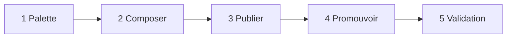

# Guide d'utilisation — Catalogue builder

Ce guide explique **comment utiliser** le service builder au quotidien (interface web et API). Pour le schéma SQL, le SemVer et les détails d'architecture, voir [`builder-catalog.md`](builder-catalog.md).

## À quoi sert ce service ?

Le builder permet de :

1. **Parcourir une palette** de briques (rôles, capacités, entrées/sorties, garde-fous, cadres…).
2. **Composer un agent** en assemblant ces briques (brouillon → publication).
3. Garder des **agents custom** privés (`custom-{slug}`) utilisables par les workflows.
4. **Promouvoir** un agent custom vers le **catalogue officiel** après validation humaine.

Les agents **publiés** alimentent les tables runtime `agent_definitions` / `workflow_definitions`, consommées par l'orchestrateur comme les fichiers `catalog/*.json`.

## Prérequis

### Stack Docker (recommandé)

```powershell
cd C:\Users\WaAd\Documents\Projets\orchestrateur
docker compose build backend frontend
docker compose up -d
```

### Base de données

Sur un volume MariaDB **déjà existant**, appliquer la migration builder une fois :

```powershell
Get-Content db\002_builder.sql | docker exec -i orchestrateur-db mariadb -u orchestrateur -porchestrateur orchestrateur
```

### Peupler la palette (seeder)

```powershell
docker compose exec backend python -m core.builder.seed
```

Vérification rapide :

```powershell
curl http://localhost:8000/builder/bricks?type_code=role
curl http://localhost:8000/builder/catalog/agents
```

### Interface web

- URL : en général `http://localhost` (nginx frontend) ou le port Vite en dev (`npm run dev` dans `frontend/`).
- Onglet à choisir : **« Catalogue builder »** (pas **« Parcours »**, qui sert aux traces de conversation).

---

## Parcours dans l'UI (5 étapes)



### 1 — Palette

- Filtrez les briques par type (`role`, `capability`, `input`, `output`, `guardrail`).
- Repérez les `id` des briques utiles (affichés à côté du label) pour l'étape suivante.

### 2 — Composer

Remplissez :

| Champ | Exemple | Règle |
|-------|---------|--------|
| Slug | `mon-agent-test` | Unique, URL-friendly |
| Nom | `Mon agent test` | Affichage |
| Mission | `Aider à rédiger des tests…` | Texte libre |
| Propriétaire | `user:local` | Identifiant utilisateur |
| Briques | au moins un **role** | Capabilities / guardrails optionnels |

Cliquez **Créer le brouillon** → un enregistrement apparaît dans `builder_custom_agents` (statut `draft`).

### 3 — Publier

- Liste des brouillons custom pour votre `owner_user_id`.
- **Publier** matérialise l'agent en runtime avec l'id **`custom-{slug}`** (ex. `custom-mon-agent-test`).
- L'agent est alors utilisable dans les workflows comme n'importe quel `agent_definition_id`.

### 4 — Promouvoir (soumettre)

**Condition :** l'agent custom doit déjà être **publié** (étape 3).

- Indiquez l'**ID agent catalogue cible** (ex. `my_official_agent`) — identifiant final dans le catalogue officiel.
- **Soumettre la promotion** crée une ligne `builder_promotion_requests` en statut `submitted`.

### 5 — Validation (admin)

- Filtre **En attente (submitted)** pour voir les demandes.
- Notes de relecture optionnelles.
- **Approuver** : copie la composition vers `builder_agents`, publie en catalogue, UPSERT runtime, `promotion_status=promoted`.
- **Rejeter** : statut `rejected`, pas de changement catalogue.

Après approbation, l'UI affiche l'agent catalogue créé (`catalog_agent_id`, `catalog_version_id`).

---

## Même parcours en API (curl / PowerShell)

Les exemples ci-dessous existent en **deux formes** :

| Forme | Usage |
|-------|--------|
| **A — Placeholders** | Lecture pas à pas ; vous remplacez chaque `VERSION_ID`, `UUID-DU-CUSTOM-AGENT`, etc. par la valeur renvoyée par l’API. |
| **B — Variables PowerShell** | Copier-coller d’un bloc unique ; les ids sont repris depuis la réponse du brouillon (`$draft`). |

**Placeholders du guide (ne pas les coller tels quels dans l’URL ou le JSON) :**

| Placeholder | Remplacer par | Exemple (réponse draft) |
|-------------|---------------|-------------------------|
| `VERSION_ID` | entier `version_id` | `4` |
| `UUID-DU-CUSTOM-AGENT` | `custom_agent_id` (UUID) | `c332ed96-f6cc-4528-be00-484652b49ec9` |
| `REQUEST_ID` | id numérique de la demande de promotion | `1` |
| `brick_id` dans la composition | id palette (étape « Lister ») | `156` |

> **Erreurs fréquentes si le placeholder reste en place :**
> - `.../versions/VERSION_ID/publish` → `int_parsing` sur `version_id`
> - `source_id = "UUID-DU-CUSTOM-AGENT"` → `Custom agent must be published before promotion` (même après un publish réussi)

### Lister la palette

```powershell
curl "http://localhost:8000/builder/bricks?type_code=role"
```

### Créer un brouillon custom

**Corps commun (A et B) :**

```powershell
$body = @{
  slug = "mon-agent-test"
  name = "Mon agent test"
  mission = "Mission de test"
  owner_user_id = "user:local"
  composition = @(
    @{ slot = "role"; brick_id = 156; sort_order = 0 }
  )
} | ConvertTo-Json -Depth 5
```

#### A — Avec placeholders (commandes séparées)

```powershell
curl -X POST http://localhost:8000/builder/compose/custom-agents/draft `
  -H "Content-Type: application/json" `
  -d $body
```

Réponse typique (à noter avant les étapes suivantes) :

```json
{
  "custom_agent_id": "c332ed96-f6cc-4528-be00-484652b49ec9",
  "version_id": 4,
  "version": "1.0.0",
  "status": "draft"
}
```

Publier — remplacer `VERSION_ID` par l’entier de la réponse (ex. `4`) :

```powershell
curl -X POST "http://localhost:8000/builder/compose/custom-agents/versions/VERSION_ID/publish"
# ex. .../versions/4/publish
```

Promouvoir — remplacer `UUID-DU-CUSTOM-AGENT` par `custom_agent_id` de la réponse :

```powershell
$promo = @{
  requester_id = "user:local"
  source_kind = "custom_agent"
  source_id = "UUID-DU-CUSTOM-AGENT"
  target_kind = "builder_agent"
  target_id = "my_official_agent"
  proposed_payload = @{ domain_code = "dev" }
} | ConvertTo-Json -Depth 5

curl -X POST http://localhost:8000/builder/promotions `
  -H "Content-Type: application/json" `
  -d $promo
```

Approuver / rejeter — remplacer `REQUEST_ID` par l’id renvoyé à la soumission :

```powershell
curl -X POST "http://localhost:8000/builder/promotions/REQUEST_ID/approve" `
  -H "Content-Type: application/json" `
  -d '{"review_notes": "OK pour le catalogue dev"}'

curl -X POST "http://localhost:8000/builder/promotions/REQUEST_ID/reject" `
  -H "Content-Type: application/json" `
  -d '{"review_notes": "Hors perimetre"}'
```

#### B — Sans placeholders (enchaînement recommandé)

```powershell
$body = @{
  slug = "mon-agent-test"
  name = "Mon agent test"
  mission = "Mission de test"
  owner_user_id = "user:local"
  composition = @(
    @{ slot = "role"; brick_id = 156; sort_order = 0 }
  )
} | ConvertTo-Json -Depth 5

$draft = curl -s -X POST http://localhost:8000/builder/compose/custom-agents/draft `
  -H "Content-Type: application/json" `
  -d $body | ConvertFrom-Json

$draft | Format-List custom_agent_id, version_id, status

curl -X POST "http://localhost:8000/builder/compose/custom-agents/versions/$($draft.version_id)/publish"

$promo = @{
  requester_id = "user:local"
  source_kind = "custom_agent"
  source_id = $draft.custom_agent_id
  target_kind = "builder_agent"
  target_id = "my_official_agent"
  proposed_payload = @{ domain_code = "dev" }
} | ConvertTo-Json -Depth 5

$promotion = curl -s -X POST http://localhost:8000/builder/promotions `
  -H "Content-Type: application/json" `
  -d $promo | ConvertFrom-Json

curl -X POST "http://localhost:8000/builder/promotions/$($promotion.id)/approve" `
  -H "Content-Type: application/json" `
  -d '{"review_notes": "OK pour le catalogue dev"}'
```

Après publication : `runtime_agent_id` = `custom-{slug}` (ex. `custom-mon-agent-test`). Cet id sert aux **workflows** ; la **promotion** utilise `custom_agent_id` (UUID), pas `runtime_agent_id`.

### Agents catalogue officiel (déjà seedés)

```powershell
curl http://localhost:8000/builder/catalog/agents
curl http://localhost:8000/builder/catalog/workflows
```

### Créer / publier un agent catalogue (sans passer par custom)

```powershell
# Brouillon catalogue
curl -X POST http://localhost:8000/builder/compose/agents/draft `
  -H "Content-Type: application/json" `
  -d '{
    "agent_id": "my_catalog_agent",
    "name": "My agent",
    "mission": "Do something",
    "composition": [{"slot": "role", "brick_id": 156, "sort_order": 0}]
  }'

# Publier
curl -X POST "http://localhost:8000/builder/compose/agents/versions/VERSION_ID/publish"
```

---

## Propositions en attente (LLM → humain)

Quand un modèle propose une modification **sans** écrire directement dans la palette :

### Brique

```powershell
# Proposition
curl -X POST http://localhost:8000/builder/pending/bricks `
  -H "Content-Type: application/json" `
  -d '{"field_path": "label", "proposed_value": "Nouveau libelle", "target_brick_id": 235, "proposed_by": "llm"}'

# Validation humaine
curl -X POST http://localhost:8000/builder/pending/bricks/PROPOSAL_ID/approve
```

### Champ d'un brouillon agent catalogue

```powershell
curl -X POST http://localhost:8000/builder/pending/agents `
  -H "Content-Type: application/json" `
  -d '{"draft_version_id": 42, "field_path": "mission", "proposed_value": "Nouvelle mission", "proposed_by": "llm"}'

curl -X POST http://localhost:8000/builder/pending/agents/PROPOSAL_ID/approve
```

---

## Audit et sessions

```powershell
curl "http://localhost:8000/builder/audit?limit=50"
curl "http://localhost:8000/builder/audit?entity_type=builder_promotion"

curl -X POST http://localhost:8000/builder/sessions `
  -H "Content-Type: application/json" `
  -d '{"kind": "agent", "actor_type": "human", "actor_id": "user:local", "goal_prompt": "Composer un agent TDD"}'

curl http://localhost:8000/builder/sessions/SESSION_UUID
```

---

## Dépannage

| Symptôme | Cause probable | Action |
|----------|----------------|--------|
| `404` sur `/builder/*` | Image backend obsolète | `docker compose build backend && docker compose up -d backend` |
| `500` `builder_bricks doesn't exist` | Migration non appliquée | Commande `002_builder.sql` ci-dessus |
| Palette vide | Seeder non lancé | `docker compose exec backend python -m core.builder.seed` |
| `int_parsing` sur `version_id` | Placeholder `VERSION_ID` laissé dans l’URL | Remplacer par l’entier de la réponse draft (forme B ou `.../versions/4/publish`) |
| Promotion refusée « must be published » | `source_id` incorrect (placeholder UUID) ou custom non publié | Utiliser `custom_agent_id` de la réponse ; publier d’abord (`.../publish`) |
| Onglet builder absent | Frontend non rebuild | `docker compose build frontend` |
| Confusion avec « Parcours » | Autre feature (traces) | Utiliser **Catalogue builder** |

Documentation interactive : [http://localhost:8000/docs](http://localhost:8000/docs) (section **builder**).

---

## Fichiers utiles

| Fichier | Contenu |
|---------|---------|
| [`docs/guide-builder-utilisation.md`](guide-builder-utilisation.md) | Ce guide |
| [`docs/builder-catalog.md`](builder-catalog.md) | Schéma, SemVer, liste API |
| [`db/002_builder.sql`](../db/002_builder.sql) | Tables SQL |
| [`frontend/src/components/BuilderCatalogPanel.tsx`](../frontend/src/components/BuilderCatalogPanel.tsx) | UI du parcours |
| [`frontend/src/lib/builderApi.ts`](../frontend/src/lib/builderApi.ts) | Client HTTP frontend |
