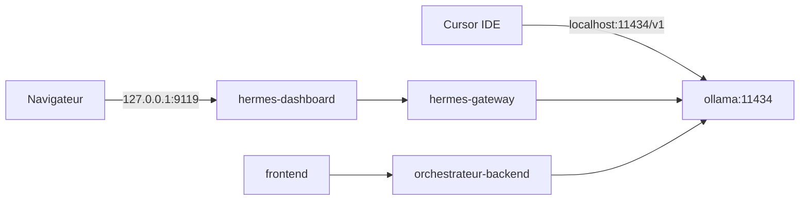
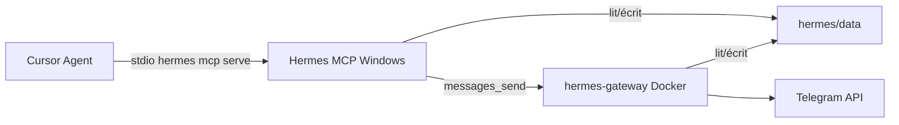

# Stack Hermes Agent (Docker + Ollama)

Overlay Compose qui ajoute **Hermes Agent** au socle orchestrateur, en réutilisant le service **`ollama`** déjà présent dans `compose.yaml` (Option A : inférence locale gratuite).

## Topologie



| Service | Rôle | Port hôte |
|---------|------|-----------|
| `ollama` | Inférence partagée (orchestrateur + Hermes + Cursor) | 11434 |
| `hermes-gateway` | Agent Hermes (gateway + dashboard intégré) | 9119 (localhost) |
| `hermes-init` | Bootstrap `config.yaml` / `.env` (one-shot) | — |

Réseau : `orchestrateur-agent-mesh` (`agent_mesh`).

## Démarrage

```bash
docker compose -f compose.yaml -f compose.hermes.yml up --build
```

Hermes seul (si le reste tourne déjà) :

```bash
docker compose -f compose.yaml -f compose.hermes.yml up hermes-gateway
```

- Dashboard : http://127.0.0.1:9119
- Ollama : http://localhost:11434
- API orchestrateur : http://localhost:8000

## Configuration Hermes → Ollama

Au premier lancement, `hermes-init` copie les fichiers bootstrap vers `hermes/data/` :

| Fichier source | Destination | Contenu |
|----------------|-------------|---------|
| `hermes/bootstrap/config.yaml` | `hermes/data/config.yaml` | `base_url: http://ollama:11434/v1`, modèle `qwen2.5-coder:1.5b` |
| `hermes/bootstrap/.env.example` | `hermes/data/.env` | Variables optionnelles (API server, messagerie) |

Le hostname **`ollama`** est résolu sur le réseau Docker interne — pas `localhost` depuis le conteneur Hermes.

Pour changer de modèle, aligner :

1. `OLLAMA_DEFAULT_MODEL` dans `.env` (pull via `ollama-init`)
2. `model.default` dans `hermes/data/config.yaml`

Puis redémarrer :

```bash
docker compose -f compose.yaml -f compose.hermes.yml restart hermes-gateway
```

## Cursor (Option A — Ollama local)

Cursor et Hermes **ne partagent pas la même config** : Cursor parle directement à Ollama exposé par Compose.

1. Vérifier qu’Ollama répond : `curl http://localhost:11434/api/tags`
2. **Cursor → Settings → Models** :
   - **Override OpenAI Base URL** : `http://localhost:11434/v1`
   - **API Key** : `ollama` (chaîne non vide)
   - **Modèle** : `qwen2.5-coder:1.5b` (identique à `ollama list`)

> Selon votre plan Cursor, les modèles personnalisés peuvent nécessiter un abonnement. L’inférence Ollama reste gratuite.

## Distinction avec l’install Windows native

Si Hermes est aussi installé via PowerShell sous `%LOCALAPPDATA%\hermes\`, c’est une **installation séparée** (données, config, PATH). La stack Docker utilise uniquement `hermes/data/` dans ce dépôt.

| | Install Windows native | Stack Docker (ce doc) |
|--|------------------------|------------------------|
| Données | `%LOCALAPPDATA%\hermes\` | `./hermes/data/` |
| Ollama | `localhost:11434` (hôte ou conteneur) | `http://ollama:11434` (réseau Docker) |
| Commande | `hermes` dans PowerShell | `docker compose …` |

## API server Hermes (optionnel)

Pour exposer Hermes comme endpoint OpenAI-compatible (Open WebUI, scripts HTTP), éditer `hermes/data/.env` :

```env
API_SERVER_ENABLED=true
API_SERVER_HOST=0.0.0.0
API_SERVER_PORT=8642
API_SERVER_KEY=change-me-local-dev
```

Ajouter dans `compose.hermes.yml` sous `hermes-gateway` :

```yaml
ports:
  - "127.0.0.1:8642:8642"
```

Puis `docker compose … restart hermes-gateway`.

## MCP Hermes dans Cursor (messagerie)

Le pont MCP expose les conversations Telegram / Discord / Slack / etc. à Cursor via `hermes mcp serve`.

### Prérequis

1. **Gateway Docker** actif (`hermes-gateway`) — même données que le MCP
2. **`HERMES_HOME` aligné** : le MCP lit `./hermes/data/` (sessions, `state.db`, pairing)
3. **Plateforme configurée** dans `hermes/data/.env` (ex. `TELEGRAM_BOT_TOKEN`)

### Configuration Cursor

Fichier projet : [`.cursor/mcp.json`](../.cursor/mcp.json)

```json
{
  "mcpServers": {
    "hermes": {
      "command": "C:\\Users\\WaAd\\AppData\\Local\\hermes\\hermes-agent\\venv\\Scripts\\hermes.exe",
      "args": ["mcp", "serve"],
      "env": {
        "HERMES_HOME": "C:\\Users\\WaAd\\Documents\\Projets\\orchestrateur\\hermes\\data"
      }
    }
  }
}
```

> Le binaire `hermes.exe` tourne sur **Windows** (stdio MCP) ; le **gateway** tourne dans **Docker**. Les deux partagent le dossier `hermes/data/`.

Après modification : **Cursor → Settings → MCP → Reload** (ou redémarrer Cursor).

### Activer Telegram

1. Créer un bot via [@BotFather](https://t.me/BotFather) → récupérer le token
2. Éditer `hermes/data/.env` :

```env
TELEGRAM_BOT_TOKEN=123456789:ABCdefGHIjklMNOpqrSTUvwxYZ
```

3. Redémarrer le gateway :

```powershell
docker compose -f compose.yaml -f compose.hermes.yml restart hermes-gateway
```

4. Sur Telegram, envoyer `/start` à votre bot
5. Approuver le pairing (code affiché par le bot) :

```powershell
$env:HERMES_HOME = "C:\Users\WaAd\Documents\Projets\orchestrateur\hermes\data"
& "C:\Users\WaAd\AppData\Local\hermes\hermes-agent\venv\Scripts\hermes.exe" pairing list
& "C:\Users\WaAd\AppData\Local\hermes\hermes-agent\venv\Scripts\hermes.exe" pairing approve telegram VOTRE_CODE
```

### Outils MCP disponibles dans Cursor

| Outil | Usage |
|-------|-------|
| `conversations_list` | Lister les conversations actives |
| `messages_read` | Lire l'historique d'une conversation |
| `messages_send` | Envoyer un message (`target="telegram:CHAT_ID"`) |
| `channels_list` | Lister les canaux / cibles disponibles |
| `events_poll` / `events_wait` | Attendre de nouveaux messages |
| `permissions_list_open` | Demandes d'approbation en attente |

### Test dans Cursor

Demandez à l'agent Cursor :

> « Utilise le MCP Hermes pour lister mes conversations Telegram »

ou

> « Envoie "Bonjour depuis Cursor" sur Telegram via Hermes »

### Schéma MCP



## Dépannage

**Hermes ne voit pas Ollama**

```bash
docker compose -f compose.yaml -f compose.hermes.yml exec hermes-gateway \
  python -c "import urllib.request; print(urllib.request.urlopen('http://ollama:11434/api/tags').read()[:200])"
```

**Modèle introuvable** — relancer le pull :

```bash
docker compose run --rm ollama-init
```

**Logs Hermes**

```bash
docker logs orchestrateur-hermes-gateway -f
```

**Dashboard : modèle « (unset) » + erreur 500 / `sqlite3.OperationalError: disk I/O error`**

Sur **Windows**, SQLite en mode WAL sur le dossier monté `hermes/data` casse souvent (fichiers `state.db-wal` / `state.db-shm` verrouillés). Le dashboard ne peut plus lire les modèles.

1. **Désactiver le MCP Hermes** dans Cursor (Settings → MCP) ou arrêter le processus `hermes.exe` — il partage le même `HERMES_HOME` et verrouille la base.
2. Réparer les bases :

```powershell
docker compose -f compose.yaml -f compose.hermes.yml stop hermes-gateway
Stop-Process -Name hermes -Force -ErrorAction SilentlyContinue
Remove-Item hermes\data\state.db-wal, hermes\data\state.db-shm -Force -ErrorAction SilentlyContinue
python -c "import sqlite3,pathlib; b=pathlib.Path('hermes/data');
for n in ('state.db','kanban.db'):
 p=b/n
 c=sqlite3.connect(p); print(n, c.execute('PRAGMA journal_mode=DELETE').fetchone()[0]); c.close()"
docker compose -f compose.yaml -f compose.hermes.yml up -d hermes-gateway
```

3. Recharger le MCP Hermes dans Cursor après redémarrage du gateway.

**`s6-log: unable to lock .../gateways/default/lock: Resource busy`**

Cause typique : **deux conteneurs** (`hermes-gateway` + `hermes-dashboard`) montent le même `hermes/data` et tentent tous deux de superviser `gateway-default` via s6-log. Sur volume Windows, le verrou échoue en boucle.

Correction : un seul conteneur avec `HERMES_DASHBOARD=1` (déjà le cas dans `compose.hermes.yml`). Supprimer l'ancien conteneur dashboard s'il tourne encore :

```powershell
docker compose -f compose.yaml -f compose.hermes.yml up -d --remove-orphans hermes-gateway
docker rm -f orchestrateur-hermes-dashboard 2>$null
```

**Contexte Ollama &lt; 64K (`32,768 tokens of runtime context`)**

Hermes exige **64K de contexte runtime** côté Ollama, pas seulement dans la config affichée. Les deux clés sont nécessaires dans `hermes/data/config.yaml` :

```yaml
model:
  default: qwen2.5-coder:7b
  context_length: 65536
  ollama_num_ctx: 65536
```

`context_length` = ce que Hermes affiche/valide. `ollama_num_ctx` = ce qu'Ollama charge réellement au runtime.

Puis redémarrer le gateway (et recharger le modèle si besoin) :

```powershell
docker compose -f compose.yaml -f compose.hermes.yml restart hermes-gateway
docker exec ollama ollama run qwen2.5-coder:7b --verbose 2>&1 | Select-String num_ctx
```

**Token Telegram rejeté (`InvalidToken`)**

Vérifier le token **exact** copié depuis [@BotFather](https://t.me/BotFather) dans `hermes/data/.env` (attention aux confusions `I` / `l` / `0` / `O`). Tester :

```powershell
curl "https://api.telegram.org/bot<VOTRE_TOKEN>/getMe"
```

Une réponse `{"ok":true,...}` confirme le token ; `401` signifie token invalide ou révoqué.
