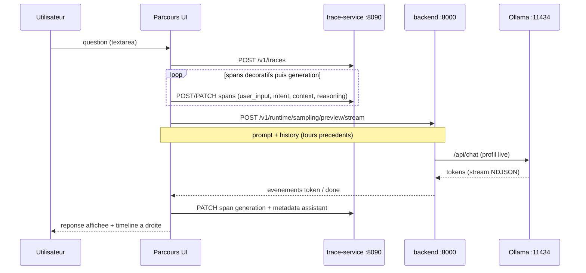
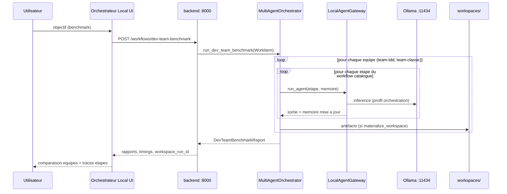
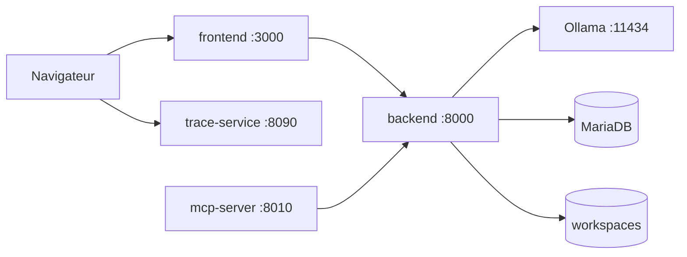

# Parcours utilisateur — « Que se passe-t-il quand je pose une question ? »

Ce document regroupe les **deux flux principaux** de l’interface web lorsque l’utilisateur saisit un texte (question, objectif, prompt). Il complète la doc éclatée existante ; il ne remplace pas les guides détaillés par service.

**Voir aussi**

| Sujet | Document |
|-------|----------|
| Traces et phases `user_input` → `response` | [`conversation-trace-service.md`](./conversation-trace-service.md) |
| Profil live, streaming, `/api/chat` | [`sampling-runtime.md`](./sampling-runtime.md) |
| Orchestrateur, pipelines, mémoire | [`architecture.md`](./architecture.md) |
| Équipes TDD / classique, benchmark | [`agents.md`](./agents.md) |
| Compose, ports, réseau | [`docker-stack.md`](./docker-stack.md) |
| Builder (≠ Parcours) | [`guide-builder-utilisation.md`](./guide-builder-utilisation.md) |
| Pont MCP vers l’API | [`mcp.md`](./mcp.md) |

---

## 1. Les onglets de l’UI (vue d’ensemble)

L’application (`frontend/`, port **3000**) expose cinq onglets. **Seuls deux** correspondent à « poser une question » au sens large ; les autres ont un autre rôle.

| Onglet (libellé UI) | Id technique | Rôle quand vous tapez du texte |
|---------------------|--------------|-------------------------------|
| **Orchestrateur Local** | `local-orchestrator` | **Flux B** — objectif → workflow multi-agents (benchmark) |
| **Parcours** | `trace-journey` | **Flux A** — question libre → chat + timeline de traces |
| **Échantillonnage** | `sampling` | Essai du profil **live** (pas d’orchestrateur multi-agents) |
| **Cours** | `sampling-course` | Pédagogie (paramètres de décodage) |
| **Catalogue builder** | `builder-catalog` | Composition d’agents (pas de question au modèle) |

Fichiers UI : [`frontend/src/pages/HomePage.tsx`](../frontend/src/pages/HomePage.tsx), [`ConversationJourneyPanel.tsx`](../frontend/src/components/ConversationJourneyPanel.tsx), [`DevTeamsSection.tsx`](../frontend/src/components/DevTeamsSection.tsx).

---

## 2. Flux A — Onglet **Parcours** (conversation + traces)

### En une phrase

Vous posez une **question libre** ; la réponse vient d’un **appel direct Ollama** (profil **live**), pendant qu’un **service de traces** enregistre une timeline « potentiel d’action ». Ce n’est **pas** l’orchestrateur multi-agents du benchmark.

### Schéma de séquence

### Étapes détaillées

1. **Session** — `conversation_id` stable (`localStorage`, voir [`conversationSession.ts`](../frontend/src/lib/conversationSession.ts)).
2. **Trace** — `POST /v1/traces` sur **trace-service** (port **8090**, variable build `VITE_TRACE_SERVICE_URL`).
3. **Spans** — Enchaînement `user_input` → `intent` → `context` → `reasoning` (résumés courts ; `intent` / `reasoning` ne pilotent pas un vrai planner séparé aujourd’hui).
4. **Génération** — `POST /v1/runtime/sampling/preview/stream` sur le **backend** avec `prompt` et optionnellement `history` (tours reconstruits depuis les métadonnées de trace `user_text` / `assistant_text`).
5. **Modèle** — Backend → **Ollama** `/api/chat`, profil **live** (réglable dans l’onglet Échantillonnage, distinct du profil **orchestration** des workflows).
6. **Affichage** — Texte streamé à gauche ; timeline des spans à droite.

### Ce qui n’est pas dans le flux A

- Pas de `POST /workflows/*`.
- Pas d’enchaînement `plan` → `research` → … ni `team-tdd` / `team-classic`.
- L’orchestrateur central (`MultiAgentOrchestrator`) n’est pas invoqué (voir [`TODO.md`](./TODO.md) : corrélation trace ↔ vrais workflows encore à renforcer).

### Fichiers et API

| Composant | Fichier / endpoint |
|-----------|-------------------|
| UI | [`frontend/src/components/ConversationJourneyPanel.tsx`](../frontend/src/components/ConversationJourneyPanel.tsx) |
| Client traces | [`frontend/src/lib/traceApi.ts`](../frontend/src/lib/traceApi.ts) |
| Client streaming | `streamSamplingPreview()` dans [`frontend/src/lib/api.ts`](../frontend/src/lib/api.ts) |
| Service traces | [`trace-service/`](../trace-service/) |
| Doc phases | [`conversation-trace-service.md`](./conversation-trace-service.md) § « Déroulé métier » |

---

## 3. Flux B — Onglet **Orchestrateur Local** (benchmark multi-agents)

### En une phrase

Vous saisissez un **objectif fonctionnel** ; l’UI appelle le **backend orchestrateur**, qui exécute **séquentiellement** les workflows catalogue `team-tdd` puis `team-classic` (plusieurs rôles, plusieurs appels Ollama, mémoire partagée, workspace disque optionnel).

### Schéma de séquence

### Étapes détaillées

1. **Saisie** — Champ objectif (et options workspace) dans [`DevTeamsSection.tsx`](../frontend/src/components/DevTeamsSection.tsx).
2. **API** — `POST /workflows/dev-team-benchmark` (corps : `objective`, `context`, `team_order`, `materialize_workspace`, …).
3. **Contrôleur** — [`WorkflowController.run_dev_team_benchmark`](../backend/app/controllers/workflow_controller.py) construit un `WorkItem`.
4. **Orchestration** — [`MultiAgentOrchestrator.run_dev_team_benchmark`](../backend/core/orchestrator.py) :
   - pour chaque `workflow_id` dans l’ordre (défaut : `team-tdd`, `team-classic`) ;
   - exécution via [`run_catalog_workflow`](../backend/core/catalog_workflow_executor.py) et le catalogue (`catalog/workflows/*.json` + MariaDB selon config) ;
   - chaque étape : [`LocalAgentGateway.run_agent`](../backend/core/agent_gateway.py) → Ollama profil **orchestration**.
5. **Résultat** — Rapport comparatif (durées, succès par équipe, `workspace_run_id` sous `./workspaces` si activé).

### Autres entrées équivalentes au flux B (hors UI)

Même logique backend, autre client :

| Entrée | Exemple |
|--------|---------|
| **curl** | `POST http://localhost:8000/workflows/dev-team-benchmark` — voir [`README.md`](../README.md) |
| **MCP** | outil `run_dev_team_benchmark` — voir [`mcp.md`](./mcp.md) |
| **Workflow catalogue seul** | `POST /workflows/catalog/{workflow_id}` (une seule équipe / un seul preset) |
| **Pipeline legacy** | `POST /workflows/specification` ou `POST /workflows/repo-audit` (4 étapes `plan` → `verify`) |

### Fichiers et API

| Composant | Fichier / endpoint |
|-----------|-------------------|
| UI benchmark | [`frontend/src/components/DevTeamsSection.tsx`](../frontend/src/components/DevTeamsSection.tsx) |
| Client HTTP | `runDevTeamBenchmark()` dans [`frontend/src/lib/api.ts`](../frontend/src/lib/api.ts) |
| Cœur métier | [`backend/core/orchestrator.py`](../backend/core/orchestrator.py) |
| Topologie interne | [`architecture.md`](./architecture.md) § « Topologie logique » |
| Pipelines catalogue | [`agents.md`](./agents.md), [`catalog/workflows/`](../catalog/workflows/) |

---

## 4. Comparatif A vs B

| Critère | **Flux A — Parcours** | **Flux B — Orchestrateur Local** |
|---------|------------------------|----------------------------------|
| **Nature de la saisie** | Question / message libre | Objectif fonctionnel (benchmark) |
| **Ressemble à un chat** | Oui | Non (formulaire + rapport) |
| **Service trace dédié** | Oui (`:8090`) | Non (journal d’étapes workflow dans la réponse API / UI) |
| **Appelle l’orchestrateur multi-agents** | Non | Oui |
| **Profil Ollama** | **Live** (réglable à la volée) | **Orchestration** (figé au démarrage, `OLLAMA_*`) |
| **Endpoint principal** | `/v1/runtime/sampling/preview/stream` | `/workflows/dev-team-benchmark` |
| **Durée typique** | Secondes | Minutes (nombreuses étapes) |
| **Artefacts disque** | Non (hors persistance traces SQLite) | Oui (`workspaces/` si `materialize_workspace`) |
| **Doc détaillée** | [`conversation-trace-service.md`](./conversation-trace-service.md), [`sampling-runtime.md`](./sampling-runtime.md) | [`agents.md`](./agents.md), [`architecture.md`](./architecture.md) |

---

## 5. Les autres onglets (pour éviter la confusion)

### Échantillonnage / Cours

- Même **backend** et même famille d’endpoints que la **génération** du flux A (`sampling/preview/stream`).
- Pas de trace-service obligatoire ; pas de workflow catalogue.
- Doc : [`sampling-runtime.md`](./sampling-runtime.md), [`EXPLAIN.md`](./EXPLAIN.md), [`cours-echantillonnage.md`](./cours-echantillonnage.md).

### Catalogue builder

- Création / publication d’**agents** (`custom-{slug}`) pour les workflows futurs.
- Ne pas confondre avec l’onglet **Parcours** (traces conversation) — voir [`guide-builder-utilisation.md`](./guide-builder-utilisation.md).

### Chat Cursor (hors dépôt)

- Poser une question dans **Cursor** n’active pas automatiquement ce projet.
- Avec le **serveur MCP** configuré (`mcp-server/`), les outils MCP déclenchent le **flux B** (ou variantes catalogue) via l’API `:8000`.

---

## 6. Stack réseau (rappel)

Le flux **A** utilise **trois** cibles depuis le navigateur (`frontend`, `trace-service`, `backend`). Le flux **B** n’utilise que **`frontend` → `backend`** (plus Ollama et éventuellement disque côté serveur).

---

## 7. Dépannage rapide

| Symptôme | Flux | Piste |
|----------|------|-------|
| Timeline vide / erreur traces | A | `trace-service` up (`:8090`), `VITE_TRACE_SERVICE_URL`, CORS `TRACE_CORS_ORIGINS` |
| Pas de réponse texte | A | Backend `:8000`, Ollama, modèle tiré (`ollama list`) |
| Benchmark qui timeout | B | `ORCHESTRATOR_HTTP_TIMEOUT_SECONDS`, modèle léger, logs backend |
| « Je voulais des agents » en restant sur Parcours | A | Utiliser **Orchestrateur Local** ou MCP / `POST /workflows/...` |
| « Je voulais juste tester un réglage température » | — | Onglet **Échantillonnage**, pas Parcours ni benchmark |

---

## 8. Évolutions documentées

- Brancher le **trace-service** sur les vrais workflows (spans alimentés par `MultiAgentOrchestrator`, pas seulement la démo Parcours) — [`TODO.md`](./TODO.md).
- Exposer à nouveau **repo-audit** dans l’UI si besoin (l’API `POST /workflows/repo-audit` existe ; le flux interne reste le pipeline 4 étapes décrit dans [`architecture.md`](./architecture.md)).
